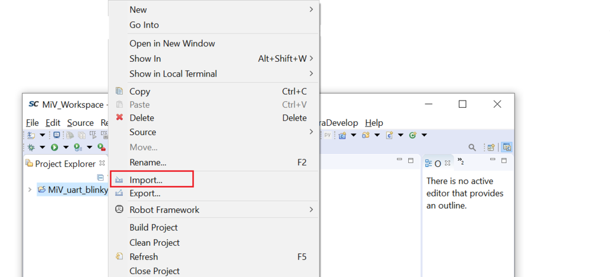
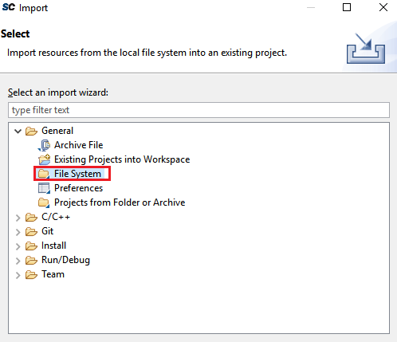
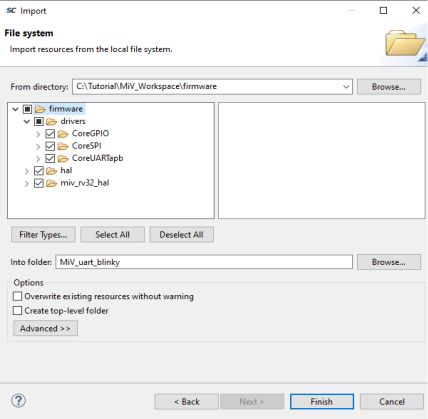

# Importing the Firmware Drivers

After the driver files are downloaded, they must be imported into the empty project.

To import the drivers, perform the following steps:

1.  In SoftConsole, right-click the **MiV\_uart\_blinky** project, and select **Import**, as shown in the following figure.

    

2.  In the **Import** dialog box, expand the **General** folder, and double-click **File System**, as shown in the following figure.

    

3.  On the next page of the **Import** dialog box, do the following:

    -   Click **Browse**, and locate the folder where you downloaded the drivers.
    -   From the folder, select the **drivers**, **filelist**, **hal**, and **miv\_rv32\_hal** folders.
    -   Click **Finish**.
    

The miv\_rv32\_hal, hal, and driver files are imported into the  **MiV\_uart\_blinky** project.

**Parent topic:**[Building the User Application Using SoftConsole](GUID-C680D538-D263-4D33-B37A-DB0AD0011184.md)

