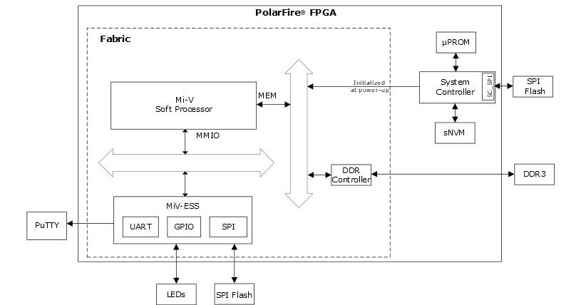

# Design Description

The application notes describes how to create a Mi-V subsystem for  executing user applications. The user application can be stored in µPROM, sNVM, or an  external SPI flash. At device power-up, the PolarFire System Controller initializes the  designated TCM with the user application and releases the system reset. If the user  application is stored in SPI Flash, the System Controller uses the SC\_SPI interface for  reading the user application from SPI Flash. The given user application prints the UART  message “Hello World!” and blinks user LEDs on the board.

The following figure shows the top-level block diagram of the design.

-   **[Fabric RAMs Initialization](GUID-EFA310D7-CD2A-4773-8F02-556A701D410F.md)**  

