# Mapping Firmware Drivers and the Linker Script

At this stage, the drivers and the `MIV_RV32 HAL` files are  not mapped. Therefore, the corresponding header files in the `main.c` file  are unresolved, as shown in the following figure.

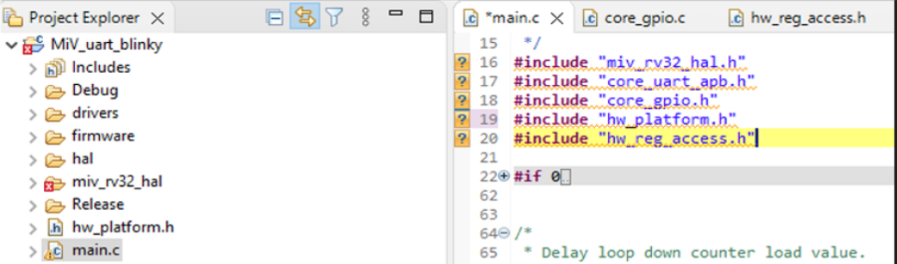

To map the drivers and HAL files, perform the following steps:

1.  Right-click **MiV\_uart\_blinky** project, and select **Properties**.
2.  Expand **C/C++ Build**, and select **Settings**.
3.  Set the configuration to **All Configurations**, as shown in the following figure. This setting applies the upcoming tool settings to both release and debug modes.

    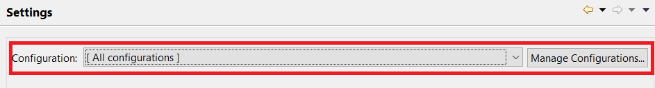

4.  In the **Tool Settings** tab, expand **Target Processor**, and ensure to select the following settings.
    -   Architecture: RV32I \(-march=rv32i\*\)
    -   Integer ABI: ILP32\(-mabi=ilp32\*\)
    -   Multiply extension: Enabled

        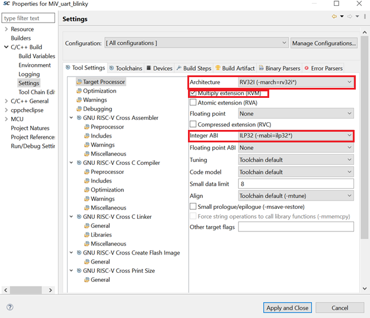

5.  Expand **GNU RISC-V Cross C Compiler**, and select **Includes**.
6.  Click the **Add** icon to add the driver and MIV\_RV32 HAL directories, as shown in the following figure.

    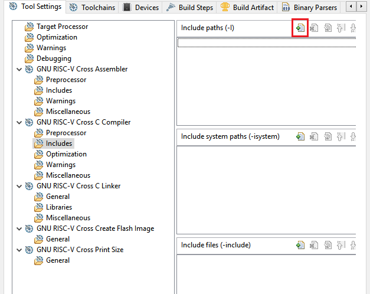

    **Important:** This application does not require including system paths and other files.

7.  In the **Add directory path** dialog box, click **Workspace**, as shown in the following figure.

    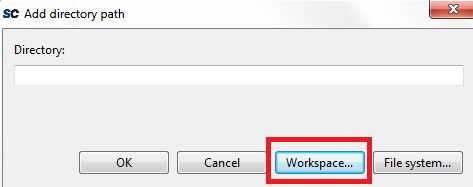

8.  In the **Folder selection** dialog box, expand **MiV\_uart\_blinky project** &gt; **drivers**, select the **CoreGPIO** folder, and click **OK**, as shown in the following figure.

    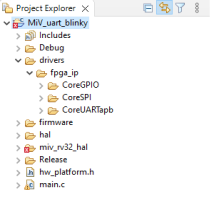

9.  In the **Add directory path** dialog box, click **OK**.

    The CoreGPIO folder path is added, as  shown in the following figure.

    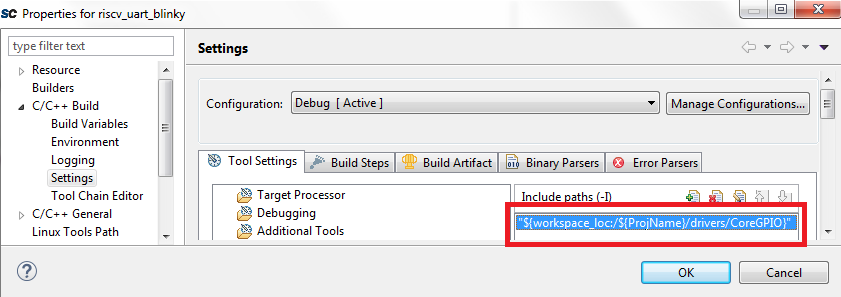

10. Repeat the preceding steps to add the **CoreUARTapb**, **CoreSPI**, **hal**, **MIV\_RV32\_HAL**, and **MiV\_uart\_blinky** \(ProjName\) folder paths.

    The drivers and MIV\_RV32\_HAL files are  successfully mapped, as shown in the following figure.

    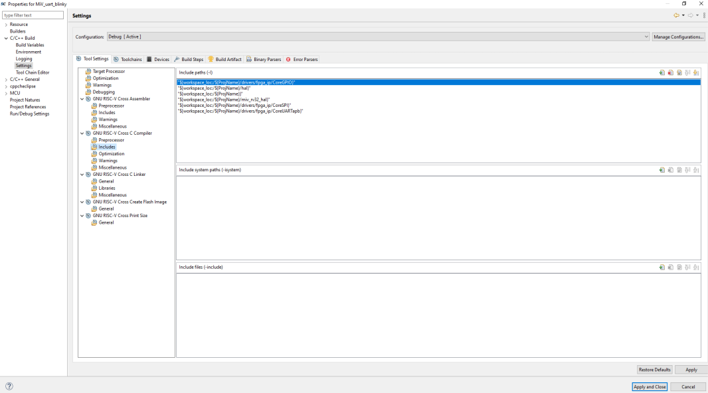

11. Select the **GNU RISC-V Cross C Linker** &gt; **General** to map the linker script.
12. Click **Add** icon as shown in [Figure   4](#FIG_MZY_VFV_PXB), and in the **Add file path** dialog, click **Workspace** as shown in [Figure   5](#FIG_BHW_1GV_PXB).
13. In the **File selection** dialog box, expand **MiV\_uart\_blinky** and select the linker script, as shown in the following figure.

    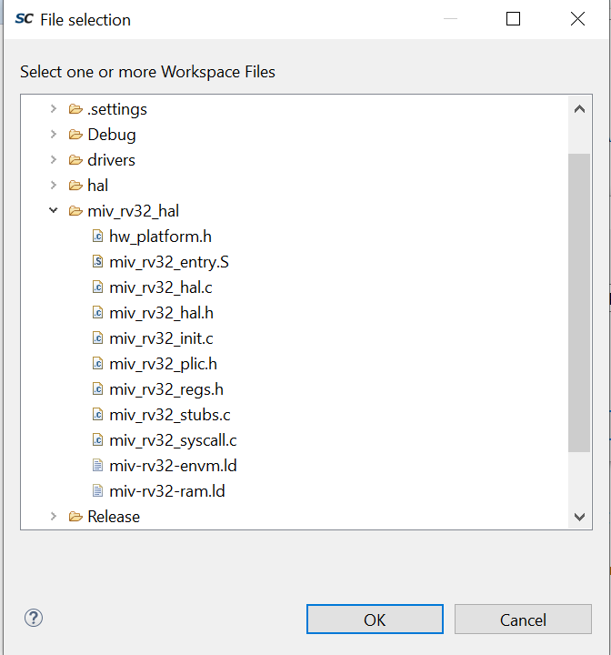

14. The linker script is mapped as shown in the following figure.

    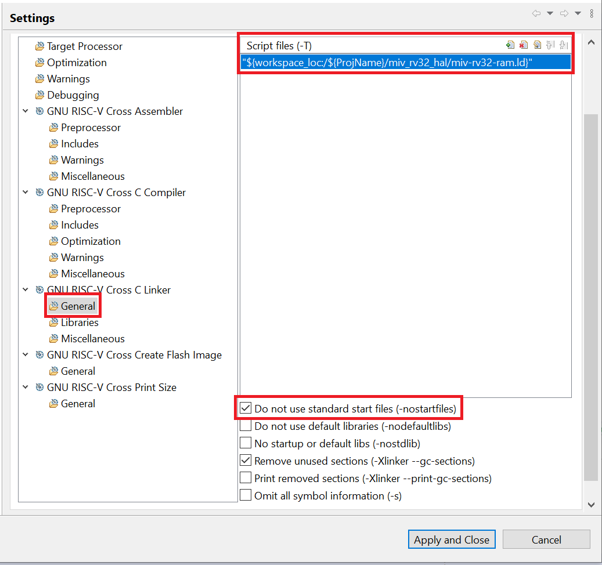

15. Select the **Do not use standard start files \(-nostartfiles\)** option as shown in preceding figure.
16. Select the **GNU RISC-V Cross Create Flash Image** &gt; **General** and set **Other Flags** to `“--change-section-lma *-0x80000000”` as shown in the following figure. This excludes the extended linear record in the first line of the hex file.

    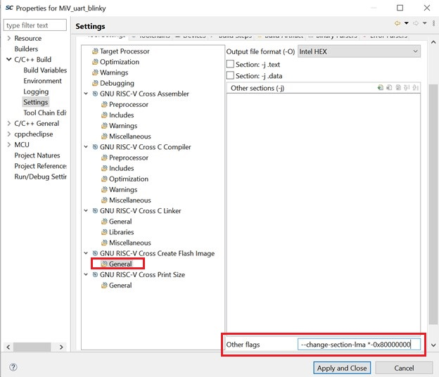

17. Click **Apply** and when prompted to rebuild, choose **Yes**.
18. Then click **Apply** and **Close**.

The firmware drivers and linker script are successfully mapped. Notice  that the header files are now resolved in the `main.c` file.

**Parent topic:**[Building the User Application Using SoftConsole](GUID-C680D538-D263-4D33-B37A-DB0AD0011184.md)

