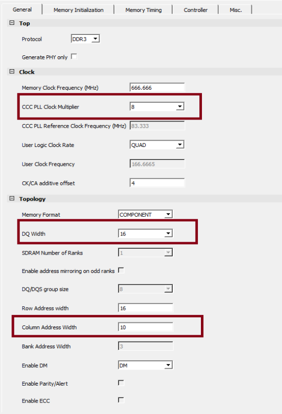
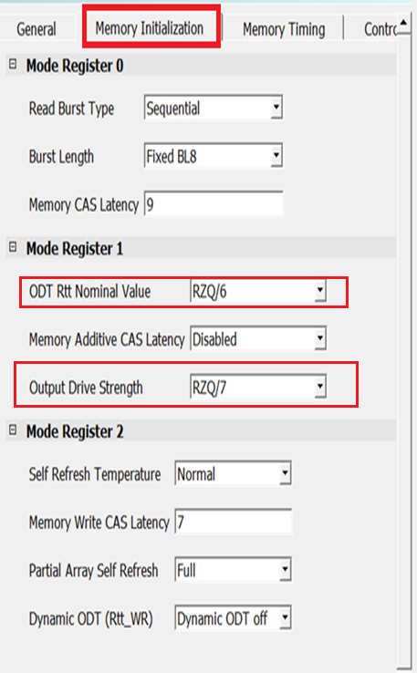
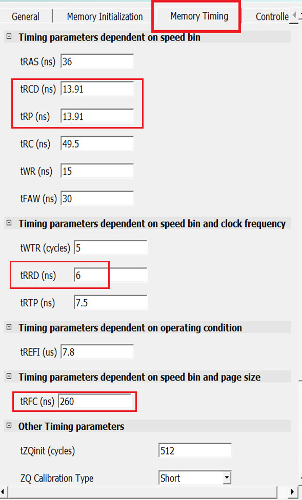
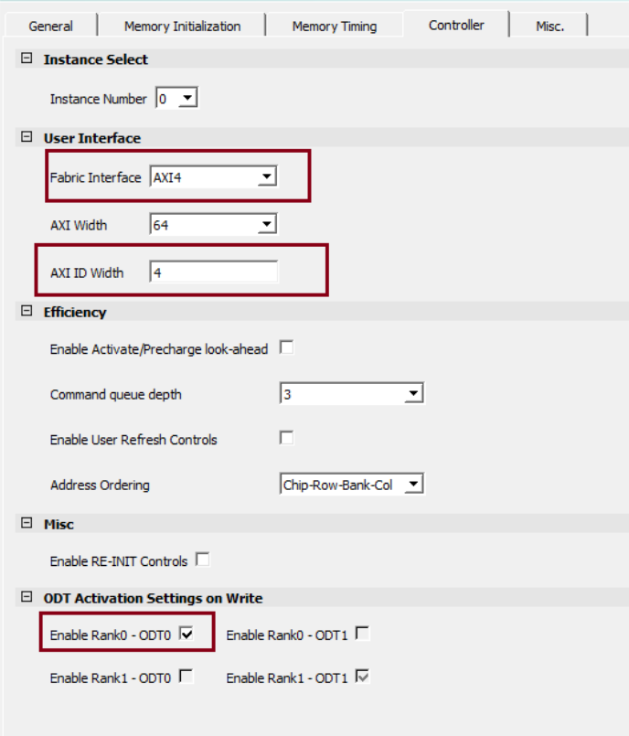
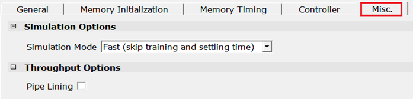

# Appendix 2 - DDR3 Configuration

If you are using Rev F kit, the following are the configurations for DDR3 controller with the initialization and timing parameters for **MT41K512M8DA-107: P** part present on the Rev F PolarFire Evaluation kit.

1.  On **General** tab, set **CCC PLL Clock Multiplier** to **8**, **DQ Width** as **16**, and **Column Address Width** as **10**, as shown in following figure. The clock multiplier value of 8 sets the CCC PLL reference clock frequency to 83.333 MHz.
A reference clock of this frequency is required for the PLL present inside the DDR3 subsystem. The PLL generates a 666.666 MHz DDR3 memory clock frequency and a 166.666 MHz DDR3 AXI clock frequency. The **DQ Width** is set to **16** to match the width of the DDR3 memory present on the board.

    

2.  On the **Memory Initialization** tab, set the initialization configuration settings for the DDR3 memory as shown in the following figure.

    

3.  On the **Memory Timing** tab, set the timing configuration settings for the DDR3 memory as shown in the following figure.

    

4.  On the **Controller** tab, set the controller configuration settings for the DDR3 memory as shown in the following figure.

    

5.  On the **Misc.** tab, set the miscellaneous configuration settings for the DDR3 memory as shown in the following figure.

    

