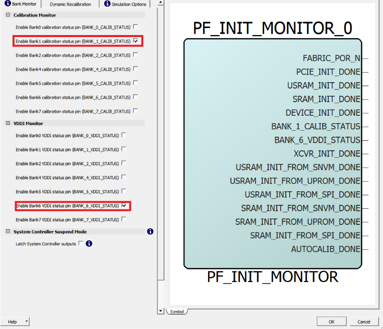

# Instantiating PolarFire Initialization Monitor

The PolarFire Initialization Monitor is used to get the status of device initialization including the TCM initialization. To instantiate the PolarFire Initialization Monitor:

1.  From the **Catalog**, drag the **PolarFire Initialization Monitor** core to **SmartDesign**.
2.  In the **Create Component** dialog box, enter **INIT\_Monitor** as the component name, and then click **OK**.
3.  In the **INIT\_MONITOR Configurator**, navigate to the **Bank Monitor** tab. Clear all the check boxes under **Calibration Monitor** except for **BANK\_1\_CALIB\_STATUS**, and clear all the check boxes under **VDDI Monitor** except for **BANK\_6\_VDDI\_STATUS**. Once completed, click **OK**.

**Parent topic:**[Instantiating IP Cores in SmartDesign](GUID-A1861753-3831-498C-B76D-F50D448A5B80.md)

