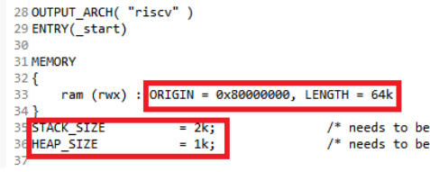
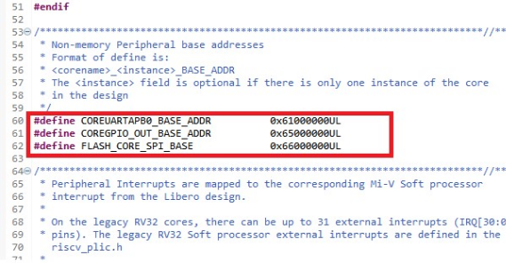

# Mapping Memory and Peripheral Addresses

In the Libero design flow, the Mi-V processor execution memory address is mapped to 0x80000000, and its size is set to 64 KB. This information must be checked in the linker script before building the application.

To map the memory address, perform the following steps:

1.  Open the linker script \(`miv-rv32-ram.ld`\) available in the MIV\_RV32\_HAL folder.
2.  Ensure that the ram ORIGIN address is mapped to 0x80000000.
3.  Ensure that the LENGTH of the ram is 64 KB.
4.  Ensure that the HEAP\_SIZE is 1 KB.
5.  Save the file.

**Important:** The MTVEC\_OFFSET macro places trap vectors appropriately. This macro is already defined in the `miv-rv32-ram.ld` file.

The following figure shows the linker script.

In the Libero design flow, the UART, GPIO, and SPI peripheral addresses are mapped to 0x61000000, 0x65000000, and 0x66000000 respectively. This information needs to be provided in the `hw_platform.h` file.

To map the peripheral address, perform the following steps:

1.  Open the hardware platform header file \(`hw_platform.h`\).
2.  Ensure that the SYS\_CLK\_FREQ macro is defined as 83333000UL.
3.  Ensure that the COREUARTAPB0\_BASE\_ADDR macro is defined as 0x61000000.
4.  Ensure that the COREGPIO\_OUT\_BASE\_ADDR macro is defined as 0x65000000.
5.  Ensure that the FLASH\_CORE\_SPI\_BASE macro is defined as 0x66000000.
6.  Save the file.

The following figure shows the`hw_platform.h` after these updates.

The memory and peripheral addresses are successfully mapped.

**Parent topic:**[Building the User Application Using SoftConsole](GUID-C680D538-D263-4D33-B37A-DB0AD0011184.md)

