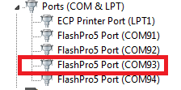
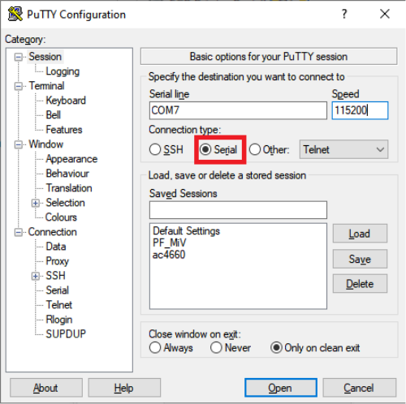
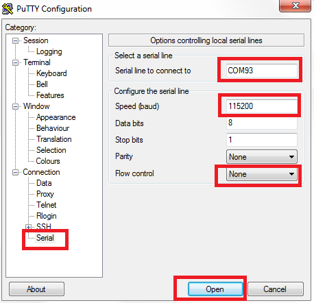

# Serial Terminal Emulation Program \(PuTTY\) Setup

The user application \(`MiV_uart_blinky.hex` file\) prints the string "Hello World!" on the serial terminal through the UART interface.

To set up the serial terminal, perform the following steps :

1.  Start the PuTTY program.
2.  Start Device Manager, note the second-highest COM port number, and use that in the PuTTY configuration. For example, in the list of ports shown in the following figure, COM93 is the port with the second highest number assigned to it.

    

3.  Select **Serial** as the **Connection type**, as shown in the following figure.

    

4.  Set the serial line to connect to the COM port number as noted in Step 3.
5.  Set the **Speed \(baud\)** to **115200** and **Flow Control** to **None**, as shown in the following figure.

    

6.  Click **Open**.

PuTTY opens successfully, and the serial terminal emulation program is set up.

**Parent topic:**[Run PROGRAM Action](GUID-F1F4BAD9-BDD2-4B06-B35A-6CFC4360792A.md)

