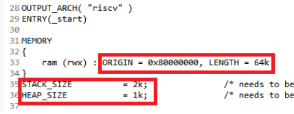
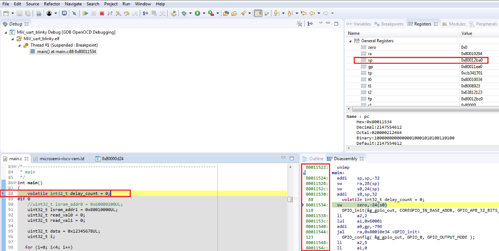

# Debugging the User Application from DDR3 Memory

The SoftConsole debugger loads the application to the memory-mapped RAM  based on the RAM start address specified in the `miv-rv32-ram.ld linker`  file. The following figure shows the RAM Start Address parameters in the linker file.

The SoftConsole reference project specifies the TCM start address, which  is 0x80000000 \(as shown in the preceding figure\). To perform application debugging from  DDR3 memory, modify this value to the DDR3 memory starting address, 0x80010000. After  modifying the value, clean and build the project.

When the application is debugged from DDR3, the stack pointer and locations in the disassembly must point to DDR3 address, as shown in the following figure.

**Parent topic:**[Building the User Application Using SoftConsole](GUID-C680D538-D263-4D33-B37A-DB0AD0011184.md)

