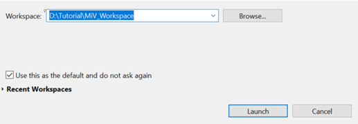
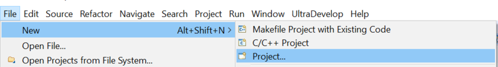
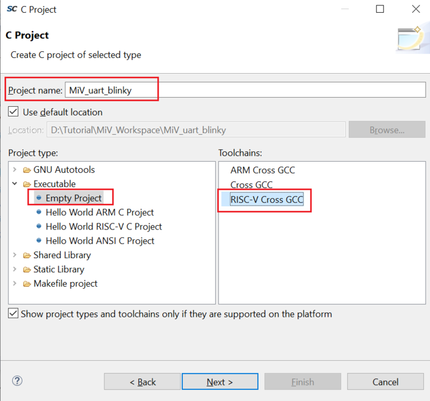
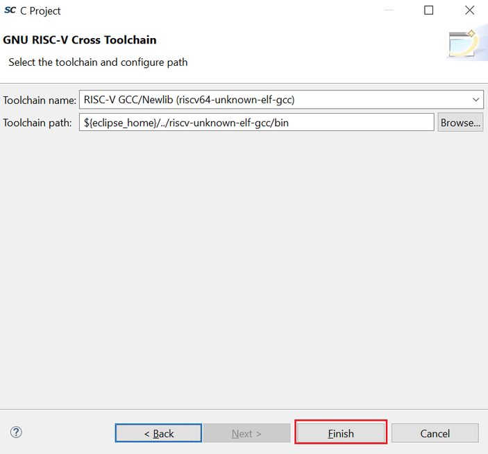
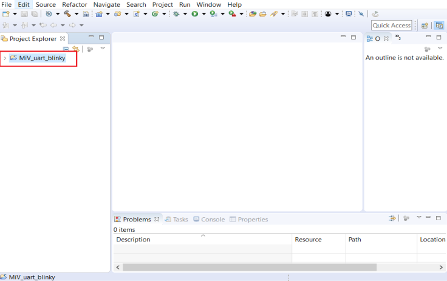

# Creating a Mi-V SoftConsole Project

To create a Mi-V SoftConsole project, perform the following steps:

1.  Create a SoftConsole workspace folder on the host PC for storing SoftConsole projects. For example, `D:\Tutorial\MiV_Workspace`.
2.  Start SoftConsole.
3.  In the **Workspace Launcher** dialog box, paste `D:\Tutorial\MiV_Workspace` as the workspace location, and click **Launch**, as shown in the following figure.

    

    When the workspace is successfully created, the SoftConsole  main window opens.

4.  Select **File** &gt; **New** &gt; **Project**, as shown in the following figure.

    

5.  Expand **C/C++** and select **C Project** in the **New Project** dialog box.
6.  Click **Next**.
7.  In the **C Project** dialog box, perform the following steps:
    -   Enter a name for the project in the **Project name** field. For example, MiV\_uart\_blinky.
    -   In the **Project type** pane, expand **Executable**, and select **Empty Project** and the **Toolchains** as **RISC-V Cross GCC**, as shown in the following figure. Then, click **Next**.

        

8.  Select the platforms and configurations you want to deploy in the **Select Configurations** dialog box and click **Next**, as shown in the following figure.

    

9.  Ensure that the **Toolchain name** and **Toolchain path** in the **GNU RISC-V Cross Toolchain** dialog box are set as shown in the following figure.

    

10. Click **Finish** in the **GNU RISC-V Cross Toolchain** wizard.

    An empty Mi-V project  \(MiV\_uart\_blinky\) is created, as shown in the following figure.

    

**Parent topic:**[Building the User Application Using SoftConsole](GUID-C680D538-D263-4D33-B37A-DB0AD0011184.md)

