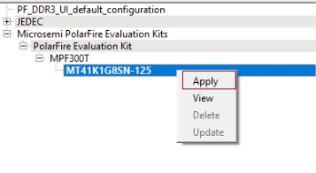
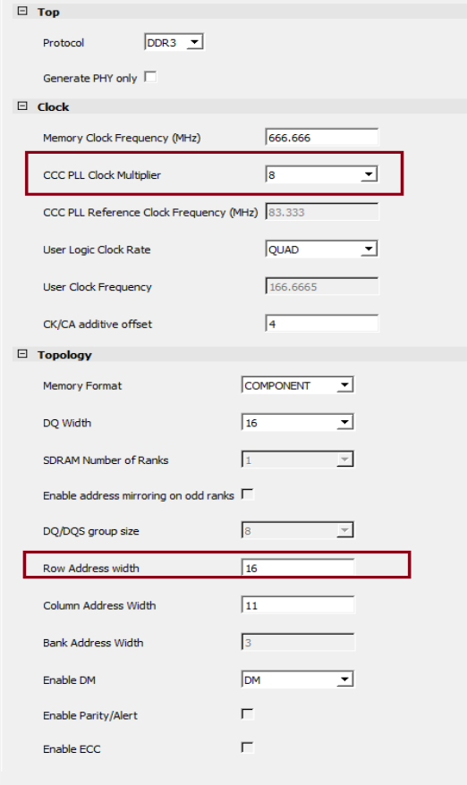
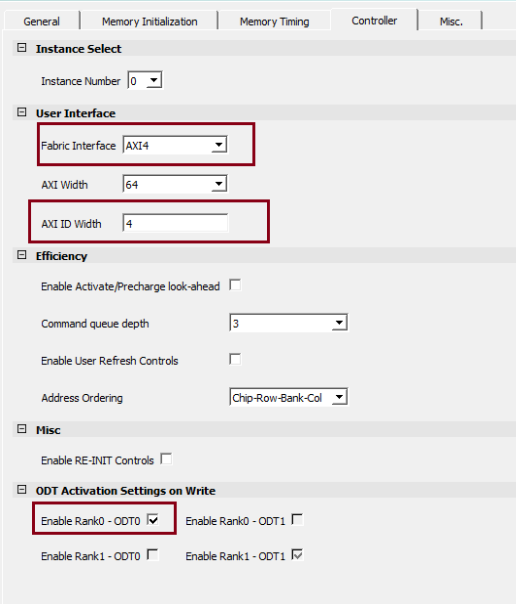

# Instantiating DDR3 Memory Controller

This application notes demonstrates how to build and debug an application from DDR3 memory. Executing an application from DDR3 memory in the release mode requires a bootloader. The bootloader use case isn't in the scope of this application notes.

If you are using the Rev D Kit, configure the DDR IP as follows. \(If you are using Rev F Kit, see [Appendix 3 - References](GUID-41ABB3E7-30FE-426A-88F7-5FFE9D37AD7F.md)\)

1.  From the Catalog, drag the **PolarFire DDR3** IP core to SmartDesign.
2.  In the **Create Component** dialog box, enter **PF\_DDR3\_C0** as the component name, and then click **OK**.
3.  In the left pane of the **Configurator**, expand **Microchip PolarFire Evaluation Kits** &gt; **PolarFire Evaluation Kit** &gt; **MPF300T**.
4.  Left-click **MT41K1G8SN-125**, and then click **Apply**, as shown in the following figure.

    

    This configures the DDR3 controller with the initialization and timing parameters of the DDR3 memory \(MT41K1G8SN-125\) present on the PolarFire Evaluation kit.

5.  In the right pane of the **Configurator**, click on the **General** tab, set the **CCC PLL Clock Multiplier** to **8**, and the **DQ Width** to **16**, as shown in the following figure.

    The clock multiplier value of 8 sets the CCC PLL reference clock frequency to **83.333** MHz. A reference clock of this frequency is required for the PLL present inside the DDR3 subsystem. The PLL generates a 666.666 MHz DDR3 memory clock frequency and a 166.666 MHz DDR3 AXI clock frequency.

    The **DQ Width** is set to **16** to match the width of the DDR3 memory present on the board.

    

6.  On the **Controller** tab, ensure that the settings are as follows:

    -   Instance Number: 0
    -   Fabric Interface: AXI4
    -   AXI ID Width: 4
    -   Enable Rank0 - ODT0 check box: Selected
    

7.  Retain the default settings for other tabs, and then click **OK**.

**Parent topic:**[Instantiating IP Cores in SmartDesign](GUID-A1861753-3831-498C-B76D-F50D448A5B80.md)

