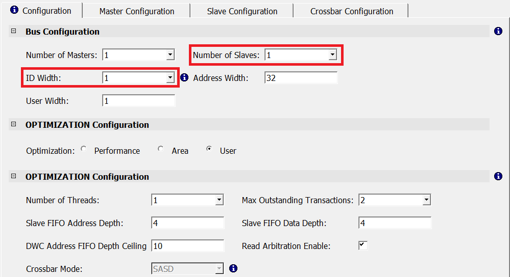
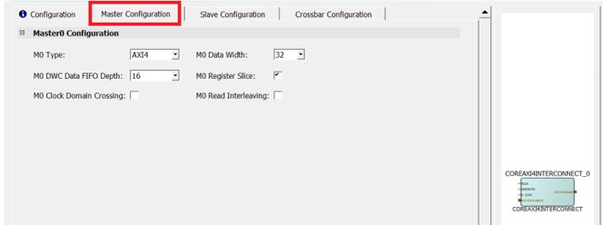
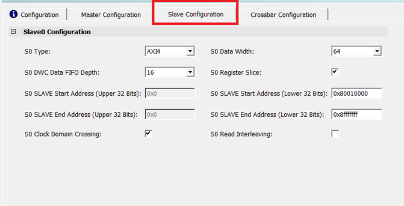
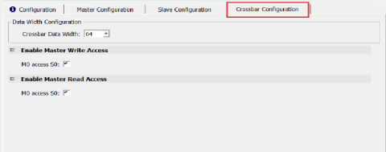

# Instantiating AXI Interconnect Bus IP

The AXI interconnect bus must be configured to connect the Mi-V core with memory. Also, the AXI4Interconnect is needed for converting the Mi-V processor’s AXI4 32-bit data to the DDR3 AXI4 64-bit data, and also for bridging the Mi-V processor’s AXI4 clock rate of 83.3 MHz to the DDR3 AXI4 clock rate of 166.66 MHz.

1.  From the **Catalog**, drag the **CoreAXI4Interconnect** IP core to SmartDesign.
2.  In the **Create Component** dialog box, enter **COREAXI4INTERCONNECT\_C0** as the component name, and click **OK**. The **Configurator** window opens.
3.  Under the **Configuration** tab, in the **Bus Configuration** section, configure the **COREAXI4INTERCONNECT** IP to have one slave with an ID width of 1, as shown in the following figure. Leave the rest as defaults.

    

4.  In the **Master Configuration** tab, retain the following Master0 configuration default settings:

    -   M0 Type: AXI4
    -   M0 Data Width: 32 bits
    -   M0 DWC Data FIFO Depth: 16
    -   M0 Register Slice: Selected
    The following figure shows the Master0 configuration.

    

5.  In the **Slave Configuration** tab, configure the Slave0 port as follows:
    -   S0 SLAVE Start Address \(Lower 32 bits\): 0x80010000
    -   S0 SLAVE End Address \(Lower 32 bits\): 0x8FFFFFFF
    -   S0 Clock Domain Crossing: Enabled
    -   Leave the rest as defaults

        

6.  In the **Crossbar Configuration** tab, ensure that the following options are set:
    -   Under **Enable Master Write Access**, **M0 access to S0** is enabled, and under **Enable Master Read Access**, **M0 access to S0** is enabled.
    -   Leave the rest as defaults.

        

**Parent topic:**[Instantiating IP Cores in SmartDesign](GUID-A1861753-3831-498C-B76D-F50D448A5B80.md)

