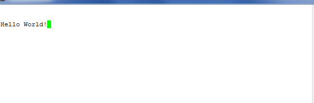

# Run PROGRAM\_SPI\_IMAGE Action

To program the SPI image:

1.  Double-click **Run PROGRAM\_SPI\_IMAGE** on the **Design Flow** tab. In the dialog box that appears, click **Yes**.
2.  When the SPI image is successfully programmed on to the device, a green tick mark appears next to **Run PROGRAM\_SPI\_IMAGE**.

After SPI flash programming is completed, the device needs to be reset to execute the application. The following sequence of operations occurs after device reset or power-cycling the board:

1.  The PolarFire System Controller initializes the TCM with the user application code from the external SPI flash and releases the system reset.
2.  The Mi-V processor exits reset after DDR3 controller is ready and executes the user application from the TCM. As a result, LEDs 4, 5, 6, and 7 blink, and the string **Hello World!** is printed on the serial terminal, as shown in the following figure.

    

3.  When the board is power cycled, the device performs the same sequence of operations. As a result, LEDs 4, 5, 6, and 7 blink, and **Hello World!** is printed again on the serial terminal, as shown in the following figure.

    

**Parent topic:**[Running the Libero Design Flow](GUID-89101F57-6885-421D-9881-42CA23E71A1B.md)

