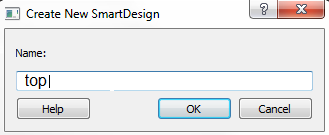

# Creating a New SmartDesign Component

To create a new SmartDesign component:

1.  In Libero, select **File** &gt; **New** &gt; **SmartDesign**.
2.  In the **Create New SmartDesign** dialog box, enter **top** as the name of the new SmartDesign project, as shown in the following figure.

    

3.  Click **OK**.

    The **top SmartDesign** component is created.

**Parent topic:**[Creating a Mi-V Processor Subsystem](GUID-EE94C957-B350-409F-8642-12DAB4A9E286.md)

