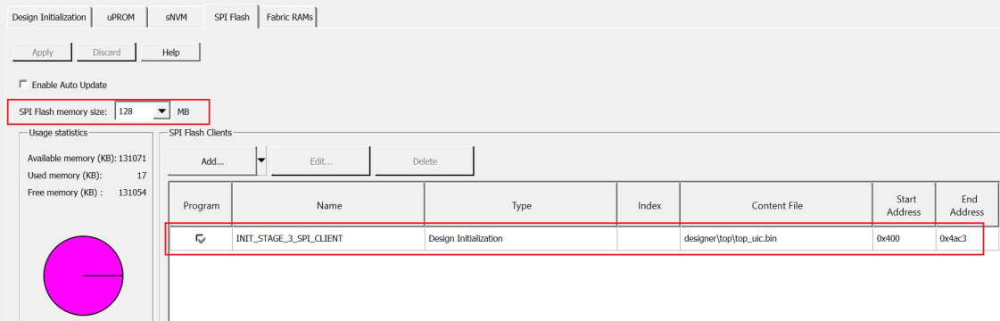

# Generate Design Initialization Data

1.  Double-click **Generate Design Initialization Data** on the **Design Flow** tab.

    When the design initialization data is generated successfully, a<br /> green tick mark appears next to Generate Design Initialization Data in the Libero<br /> Design flow, and the following messages appear in the Log<br /> window:

    ``` {#CODEBLOCK_H5J_SKB_PXB}
    Info: 'Generate design initialization data' has completed successfully.
    ```

    ``` {#CODEBLOCK_JZW_SKB_PXB}
    Info: Stage 1 initialization client has been added to sNVM.
    ```

    ``` {#CODEBLOCK_TGG_TKB_PXB}
    Info: Stage 2_3 initialization client has been added to sNVM
    ```

    ``` {#CODEBLOCK_RYL_TKB_PXB}
    Info: Stage 3 initialization client has been added to SPI.
    ```

2.  Click the **SPI Flash** tab to verify that the bin file has been added, as shown in the following figure.

    **Important:** In order to streamline the SPI-Flash Programming support with FlashPro6, effective from Libero SoC v12.4, the vendor information is replaced with the density of the target memory.

    


**Important:** For more information about design initialization, see [PolarFire Family Power-Up and Resets User Guide](https://ww1.microchip.com/downloads/aemDocuments/documents/FPGA/ProductDocuments/UserGuides/Microchip_PolarFire_FPGA_and_PolarFire_SoC_FPGA_Power_Up_and_Reset_User_Guide_VC.pdf).

**Parent topic:**[Running the Libero Design Flow](GUID-89101F57-6885-421D-9881-42CA23E71A1B.md)

