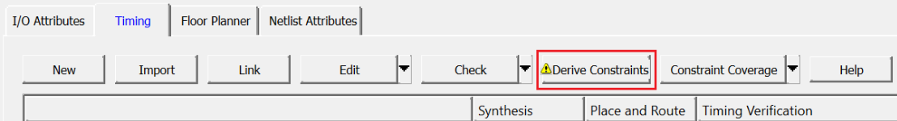
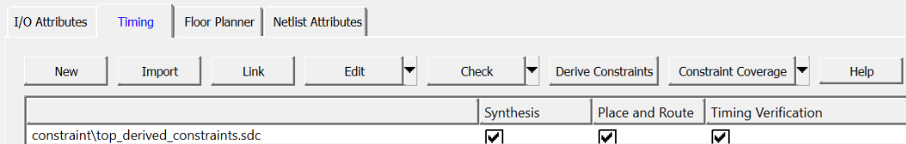

# Deriving Constraints

To derive constraints, perform the following steps:

1.  Double-click **Manage Constraints** on the **Design Flow** tab.
2.  In the **Manage Constraints** window, select the **Timing** tab, and click**Derive Constraints**, as shown in the following figure.

    

    The design hierarchy is built, and the `top_derived_contraints.sdc` file is generated in the project folder.

    In the dialog box that appears, click **Yes** to associate the SDC file to the **Synthesis**, **Place and Route**, and **Timing Verification** tools, as shown in the following figure.

    

3.  Click **Save**.

**Parent topic:**[Managing Timing Constraints](GUID-75F68635-D7F9-435D-8BE0-FD55AE977D03.md)

