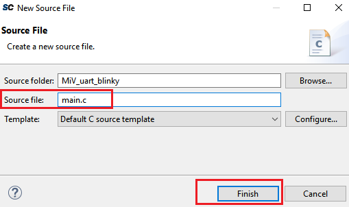
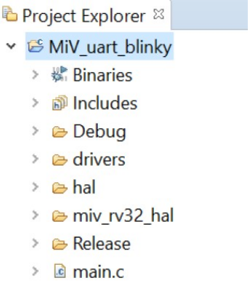
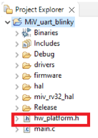

# Creating the main.c File

To update the `main.c` file, perform the following steps:

1.  On the SoftConsole menu, click **File** &gt; **New** &gt; **Source File**.
2.  In the **New Source File** dialog box, enter `main.c` in the **Source file** field, and then click **Finish**, as shown in the following figure.

    

    The `main.c` file is created inside the project, as shown in the following figure.

    

3.  Copy all of the content of the `main.c` from `DesignFiles_directory\FW`, and paste it in the `main.c` file of the SoftConsole project.
4.  Save the SoftConsole `main.c` file.
5.  Similarly, create another file named `hw_platform.h`.
6.  Copy all of the content of the `hw_platform.h` from the `DesignFiles_directory\FW`, and paste it in the newly created `hw_platform.h` file.

**Important:** The `hw_platform.h` file includes the system clock frequency, baud rate, and base addresses of peripherals. The `hw_platform.h` file appears, as shown in the following figure.

**Parent topic:**[Building the User Application Using SoftConsole](GUID-C680D538-D263-4D33-B37A-DB0AD0011184.md)

