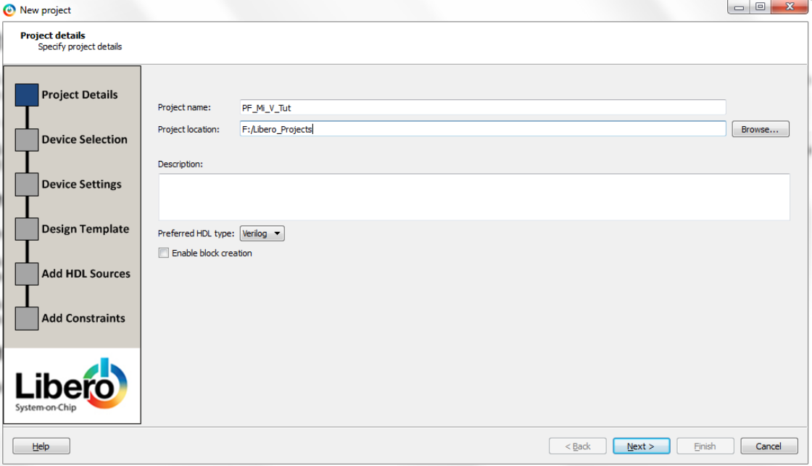
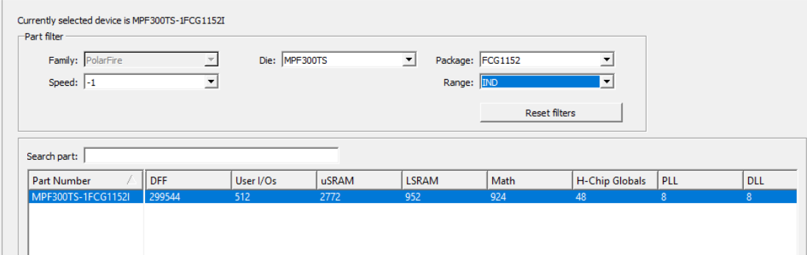

# Creating a Libero Project

To create a Libero project, follow these steps:

1.  On the Libero menu bar, click **Project** &gt; **New Project**
2.  Enter the following details, and click **Next**.
    -   Project name: PF\_Mi\_V\_Tut
    -   Project location: For example, `F:/Libero_Projects`
    -   Preferred HDL type: Verilog

        

3.  To choose the PolarFire® device present on the PolarFire Evaluation Board, select the following settings in the **Device Selection** window, and click **Next**.

    -   Family: PolarFire
    -   Die: MPF300TS
    -   Package: FCG1152
    -   Speed: -1
    -   Range: IND
    -   Part Number: MPF300TS-1FCG1152I
    

4.  In the **Device Settings** window, click **Next** to retain the default core voltage and I/O settings.
5.  In the **Add HDL Sources** window, click **Next** to retain the default settings.
6.  In the **Add constraints** window, click **Import file** to import the I/O constraint file.
7.  In the **Import files** window, locate the `io_constraints.pdc` file in the `DesignFiles_directory\HW\src\constraints` folder, and double-click it.
8.  Click **Finish**.

    The Log pane displays a message indicating that the PF\_Mi\_V\_Tut project was created.

**Parent topic:**[Creating a Mi-V Processor Subsystem](GUID-EE94C957-B350-409F-8642-12DAB4A9E286.md)

