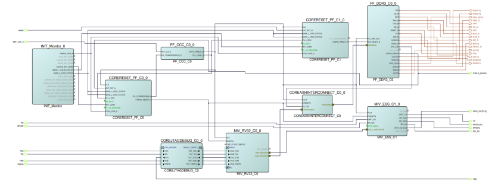

# Connecting IP Instances in SmartDesign

Connect the IP blocks in SmartDesign using any of the following methods:

-   Using the **Smart Search and Connect** icon: You can initiate the connection mode in SmartDesign by clicking the **Smart Search and Connect** icon in the SmartDesign toolbar, as shown in the following figure. You can search and select multiple ports and connect or disconnect them at once.

    

-   Using the **Connect** option in the Context menu: You can also connect pins by selecting the pins, and then selecting **Connect** from the context menu. To connect multiple pins, hold down the Ctrl key while selecting the pins. Right-click the input source signal, and select **Connect**. To disconnect signals, right-click the input source signal, and select **Disconnect**.
-   You can select the source pin, click and drag the wire to the destination pin until you see a ‘+’ sign. The pins will be automatically connected after you release the button of the mouse.
-   Right-clicking on a pin provides a list of options like Mark Unused, Edit Slice, Tie Low, Promote to Top-Level, and Tie High. Use these options for individual pins settings.

The following figure shows the Mi-V subsystem in SmartDesign with all IP blocks connected and top-level I/Os.

**Important:** Grayed out pins are marked unused, green pins are tied Low, and red pins are tied High. Ensure that unused, tied Low, and tied High pins are strictly set as per preceding figure.

To connect the IP blocks, perform the following steps:

1.  Set the pins as follows on **INIT\_MONITOR\_0**:
    1.  Select PCIE\_INIT\_DONE, USRAM\_INIT\_DONE, SRAM\_INIT\_DONE, XCVR\_INIT\_DONE, USRAM\_INIT\_FROM\_SNVM\_DONE, USRAM\_INIT\_FROM\_UPROM\_DONE, USRAM\_INIT\_FROM\_SPI\_DONE, SRAM\_INIT\_FROM\_SNVM\_DONE, SRAM\_INIT\_FROM\_UPROM\_DONE, SRAM\_INIT\_FROM\_SPI\_DONE, and AUTOCALIB\_DONE pins.
    2.  Right-click the pins, and select **Mark Unused**.
    3.  Connect the FABRIC\_POR\_N pin to FPGA\_POR\_N pin of **CORERESET\_PF\_C0\_0** and **CORERESET\_PF\_C1\_0**.
    4.  Connect the DEVICE\_INIT\_DONE pin to CORERESET\_PF\_C0\_0:INIT\_DONE.
    5.  Connect the BANK\_1\_CALIB\_STATUS pin to CORERESET\_PF\_C1\_0:INIT\_DONE.
    6.  Connect the BANK\_6\_VDDI\_STATUS pin to CORERESET\_PF\_C0\_0:BANK\_x\_VDDI\_STATUS, CORERESET\_PF\_C0\_0:BANK\_y\_VDDI\_STATUS, CORERESET\_PF\_C1\_0:BANK\_x\_VDDI\_STATUS, and CORERESET\_PF\_C1\_0:BANK\_y\_VDDI\_STATUS.
2.  Set the pins as follows on **PF\_CCC\_C0\_0**:

    -   Right-click the REF\_CLK\_0 pin, and select **Promote to Top Level**.
    -   Connect the other pins as specified in the following table.
    |Connect From|Connect To|
    |:-----------|:---------|
    |PLL\_LOCK\_0|CORERESET\_PF\_C0\_0: PLL\_LOCK and CORERESET\_PF\_C1\_0: PLL\_LOCK|
    |OUT0\_FABCLK\_0|CORERESET\_PF\_C0\_0: CLK and CORERESET\_PF\_C1\_0:CLK|
    |MIV\_RV32\_C0\_0: CLK|
    |PF\_DDR3\_C0\_0: PLL\_REF\_CLK|
    |MIV\_ESS\_C1\_0: PCLK|
    |COREAXI4INTERCONNECT\_C0\_0: ACLK|
    |PLL\_POWERDOWN\_N\_0|CORERESET\_PF\_C0\_0: PLL\_POWERDOWN\_B|

3.  Set the pins of **CORERESET\_PF\_C0\_0** as follows:
    -   Connect EXT\_RST\_N pin to PF\_DDR3\_C0\_0:CTRLR\_READY.
    -   Right-click SS\_BUSY and FF\_US\_RESTORE pins and tie them low.
4.  Connect the CORERESET\_PF\_C0\_0: FABRIC\_RESET\_N to the following pins.

    -   MIV\_RV32\_C0\_0: RESETN
    -   COREAXI4INTERCONNECT\_C0\_0: ARESETN
    -   MIV\_ESS\_C1\_0: PRESETN
    **Important:** As PF\_DDR3\_C0\_0:CTRL\_READY pin is connected to CORERESET\_PF\_C0\_0:EXT\_RST\_N, the Mi-V processor is held in reset until the DDR3 controller is ready. The rest of the system is out of reset as soon as device initialization is done.

5.  Set the pins of **CORERESET\_PF\_C1\_0** as follows:
    -   Right-click SS\_BUSY and FF\_US\_RESTORE pins and tie them low using the Tie Low option.
    -   Select the EXT\_RST\_N pin and promote it to top level and rename it to resetn.
    -   Connect the FABRIC\_RESET\_N pin to PF\_DDR3\_C0\_0: SYS\_RESET\_N.
    -   Right-click the PLL\_POWERDOWN\_B pin and mark it unused.
6.  Set the pins as follows on **COREJTAGDEBUG\_C0\_0**:

    -   Expand **JTAG HEADER**.
    -   Right-click the TDI, TCK, TMS, and TRSTB pins, and select Promote to Top Level.
    -   Expand **JTAG HEADER**.
    -   Right-click the TDO pin, and select **Promote to Top Level**.
    -   Connect the other pins as specified in the following table.
    |Connect From|Connect to|
    |:-----------|:---------|
    |COREJTAGDEBUG\_C0\_0:TGT\_TCK\_0|MIV\_RV32\_C0\_0:JTAG\_TCK|
    |COREJTAGDEBUG\_C0\_0:TGT\_TRSTN\_0|MIV\_RV32\_C0\_0:JTAG\_TRSTN|
    |COREJTAGDEBUG\_C0\_0:TGT\_TMS\_0|MIV\_RV32\_C0\_0:JTAG\_TMS|
    |COREJTAGDEBUG\_C0\_0:TGT\_TDI\_0|MIV\_RV32\_C0\_0:JTAG\_TDI|
    |COREJTAGDEBUG\_C0\_0:TGT\_TDO\_0|MIV\_RV32\_C0\_0:JTAG\_TDO|

7.  Set the pins as follows on **MIV\_RV32\_C0\_0**:
    -   Right-click EXT\_RESETN pin, and select Mark Unused.
    -   Right-click on TIME\_COUNT\_IN\[63:0\] and tie it low.
    -   Connect the APB\_INITIATOR to MIV\_ESS\_C1\_0: APB\_0\_mINITIATOR.
    -   Connect the AXI4\_INITIATOR to COREAXI4INTERCONNECT\_C0\_0: AXI4mmaster0.
8.  Connect the **COREAXI4INTERCONNECT\_C0\_0** pins as specified in the following table.

    |COREAXI4INTERCONNECT\_C0\_0 Pin Name|Connect To|
    |:-----------------------------------|:---------|
    |S\_CLK0|PF\_DDR3\_C0\_0:SYS\_CLK|
    |AXI4mslave0|PF\_DDR3\_C0\_0:AXI4slave0|

9.  Set the pins as follows on **PF\_DDR3\_C0\_0**:
    -   Right-click the PLL\_LOCK output pin, and select **Mark Unused**.
    -   Right-click the CTRLR\_READY pin, and select **Promote to Top Level** for debug purpose. The CTRLR\_READY signal is used to monitor the status of the DDR controller.
    -   Ensure that the other pins are promoted to top level.
10. Set the pins as follows on **MIV\_ESS\_C1\_0**:
    -   Select UART\_RX and SPI\_SDI.
    -   Right-click, and select **Promote to Top Level**.
    -   Select UART\_TX, SPI\_SCK, SPI\_SDO, SPI\_SS, and GPIO\_OUT\[3:0\].
    -   Right-click, and select **Promote to Top Level**.
    -   Right-click the SPI\_IRQ, GPIO\_INT\[3:0\], and select Mark Unused.
    -   Select GPIO\_IN\[3:0\] and select Tie low.
    -   Right-click on the port "UART\_TX", and rename it to "TX".
    -   Similarly, rename "UART\_RX" to "RX", "SPI\_SCK" to "SPISCLKO", "SPI\_SDO" to "SPISDO", and "SPI\_SDI" to "SPISDI".
11. Right-click the top SmartDesign canvas, and select **Auto Arrange Layout**.
12. Click **File** &gt; **Save top**.

The IP blocks are successfully connected.

**Parent topic:**[Creating a Mi-V Processor Subsystem](GUID-EE94C957-B350-409F-8642-12DAB4A9E286.md)

