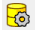
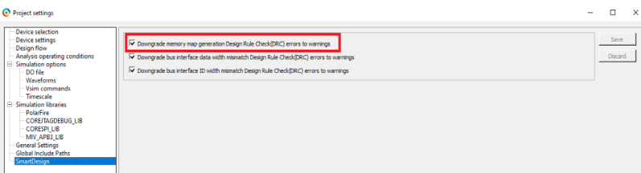

# Generating SmartDesign Component

To generate the SmartDesign component, perform the following steps:

1.  In **Design Hierarchy**, right-click top, and select **Set As Root**.
2.  Save the project.
3.  Click the **Generate Component** icon \(shown in the following figure\) on the SmartDesign toolbar.

    

    When the Mi-V component is generated, the **Message** window displays the message, “The top was generated successfully.”

    **Important:** In case any error is observed related to address space access issue, ensure to perform the following step: Navigate to **Project** &gt; **Project Settings** &gt; **SmartDesign**, and then Enable "Downgrade memory map generation DRC errors to warnings" as shown in the following figure.

    

4.  Select the **Build Hierarchy** option and save the project.

**Parent topic:**[Creating a Mi-V Processor Subsystem](GUID-EE94C957-B350-409F-8642-12DAB4A9E286.md)

