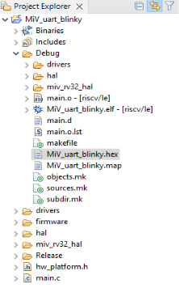
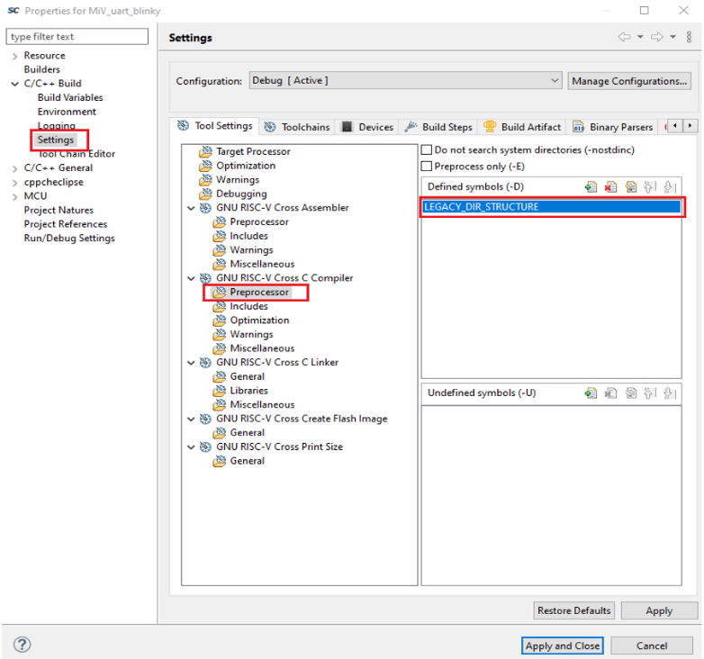

# Building the Mi-V Project

To build the Mi-V project, right-click the  **MiV\_uart\_blinky** project in SoftConsole, and select  **Build Project**.

The project is built successfully, and the HEX file is generated in the  Debug folder, as shown in the following figure.

The HEX file is used for Design and Memory Initialization. For more  information, see [Configure Design Initialization Data and Memories](GUID-D7546C2C-BCB6-4C95-80B9-52FBC50E4CA7.md).

**Important:** If the user is facing any issues with building the project, ensure that LEGACY\_DIR\_STRUCTURE is included as a defined symbol in preprocessor in the GNU RISC-V Cross C Compiler, perform the following steps:

1.  Right-click **MiV\_uart\_blinky** project, and then go to **Properties**.
2.  Go to **C/C++ Build**, click **Settings** and select **GNU RISC-V Cross Compiler** &gt; **Preprocessor** &gt; **Defined symbols \(-D\)**, and then add **LEGACY\_DIR\_STRUCTURE** as shown in the following figure.

    

**Parent topic:**[Building the User Application Using SoftConsole](GUID-C680D538-D263-4D33-B37A-DB0AD0011184.md)

