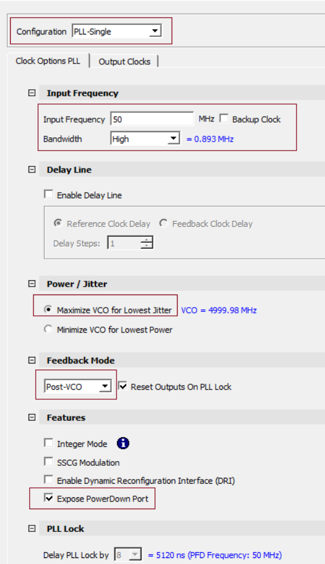
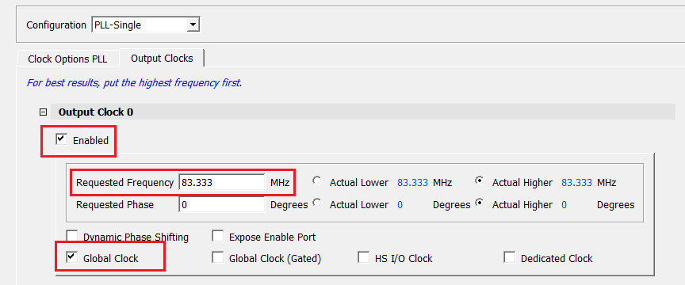

# Instantiating PolarFire Clock Conditioning Circuitry \(CCC\)

The PolarFire Clock Conditioning Circuitry \(CCC\) block generates a 83.333 MHz clock to the processor subsystem, which is used as a reference clock to the PF\_DDR3\_C0\_0 PLL. To instantiate the CCC block, perform the following steps:

1.  From the Catalog, drag the **Clock Conditioning Circuitry \(CCC\)** core to SmartDesign.
2.  In the **Create Component** dialog box, enter **PF\_CCC\_C0** as the component name, and click **OK**.
3.  In the **Configurator** screen, set the configuration to PLL-Single.
4.  In the **Clock Options PLL** tab, perform the following.
    -   Set the **Input Frequency** to 50 MHz.
    -   Under **Power/Jitter**, select Maximize VCO for Lowest Jitter.
    -   Set the feedback mode to Post-VCO.
    -   Set the Bandwidth to High.

        

5.  In the **Output Clocks** tab, under the **Output Clock 0** section, perform the following.

    -   Select the **Enabled** check box to enable PLL output 0.
    -   Set the **Requested frequency** to 83.333 MHz.
    -   Select the **Global Clock** checkbox.
    

6.  Click **OK**.

**Parent topic:**[Instantiating IP Cores in SmartDesign](GUID-A1861753-3831-498C-B76D-F50D448A5B80.md)

