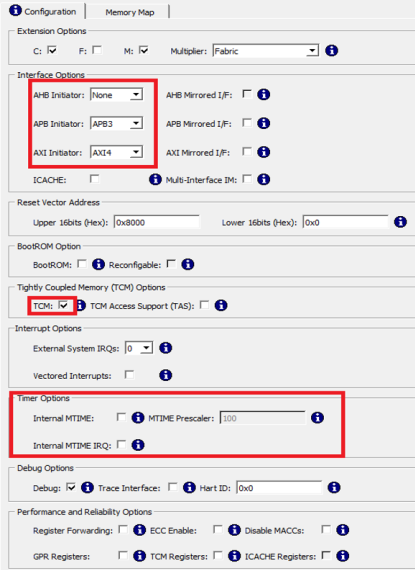
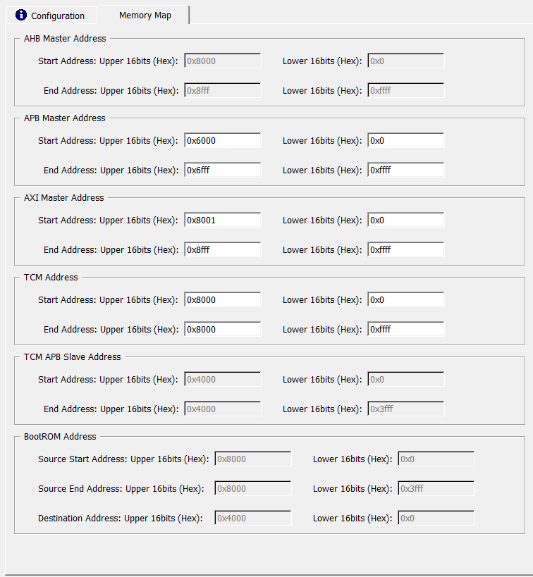

# Instantiating Mi-V Processor IP

To instantiate the Mi-V Processor IP, perform the following steps:

1.  From the **Catalog**, drag the **MIV\_RV32** to **SmartDesign**.
2.  In the **Create Component** dialog box, enter **MiV\_RV32\_C0** as the component name, and then click **OK**.
3.  In the **Configurator** window, under the **Configuration** tab, set the following configuration:

    -   Set **Reset Vector Address** &gt; **Upper 16bits \(Hex\)** to 0x8000 and retain the default setting for **Lower 16bits \(Hex\)** as shown in the following figure. This is the address the processor will start executing from after a reset.
    -   Ensure that the interface options for **AHB initiator** is set to none and AXI4 for **AXI initiator**, as shown in the following figure.
    -   Under **Tightly Coupled Memory \(TCM\) Options**, enable **TCM** option.
    -   Disable **Timer Options**.
    

4.  Click the **Memory Map** tab to review the memory map settings of TCM, DDR3, and APB peripherals, as shown in the following figure.

    

**Parent topic:**[Instantiating IP Cores in SmartDesign](GUID-A1861753-3831-498C-B76D-F50D448A5B80.md)

