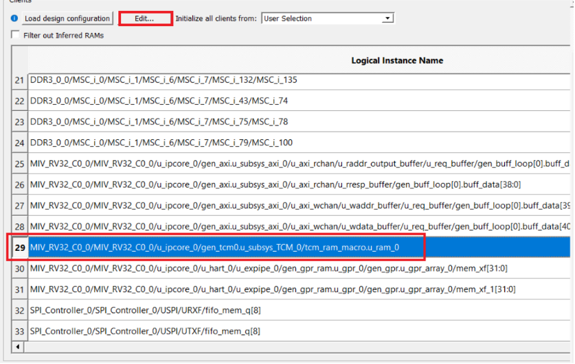
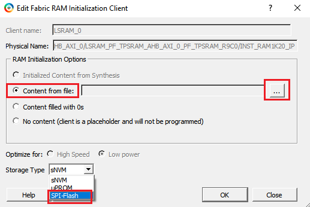
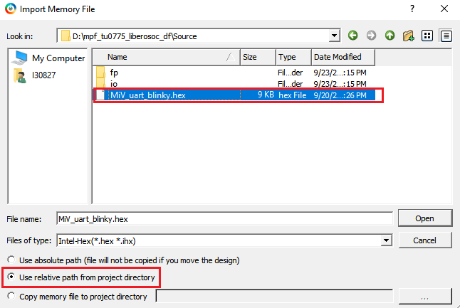
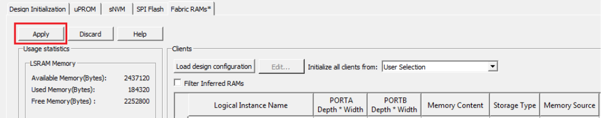
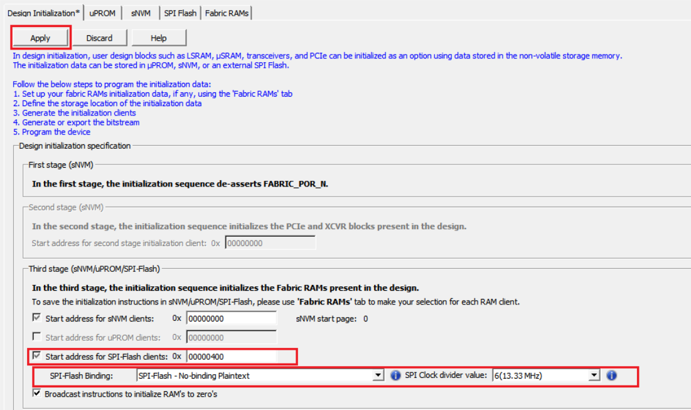

# Configure Design Initialization Data and Memories

The **Configure Design Initialization Data and Memories** step in the Libero design flow is used to configure the TCM initialization data and storage location. User can use µPROM, sNVM, or SPI Flash as storage location based on the size of the initialization data and design requirements. In this application notes, the SPI Flash memory is used to store the TCM initialization data.

This process requires the user application executable file \(HEX file\) as input to initialize the TCM blocks after device power-up. The HEX file is provided with the design files. For more information about building the user application, see [Building the User Application Using SoftConsole](GUID-C680D538-D263-4D33-B37A-DB0AD0011184.md).

**Important:** The HEX file available in the `DesignFiles_Directory\HW\src\softconsole\MiV_uart_blinky.hex` folder is already modified to be compatible.

To generate an TCM initialization client and add it to an external SPI flash device:

1.  Double-click **Configure Design Initialization Data and Memories** on the **Design Flow** tab.
2.  On the Fabric RAMs tab, select `top/MIV_RV32_C0_0/MIV_RV32_C0_0/u_ipcore_0/gen_tcm0.u_subsys_TCM_0/tcm_ram_macro.u_ram_0` from the list of logical instances, and click **Edit**, as shown in the following figure. The `top/MIV_RV32_C0_0/MIV_RV32_C0_0/u_ipcore_0/gen_tcm0.u_subsys_TCM_0/tcm_ram_macro.u_ram_0` instance is the MIV\_RV32 processor's main memory. The System Controller initializes this instance with the imported client at power-up.

    

3.  In the **Edit Fabric RAM Initialization Client** dialog box, set **Storage Type** to **SPI-Flash** and click the **Import** button next to **Content from file**, as shown in the following figure.

    

4.  In the **Import Memory File** dialog box, locate the `MiV_uart_blinky.hex` file from `DesignFiles_directory\HW\src\softconsole` folder. Select the **Use relative path from project directory** option and click **Open**.

    

5.  In the **Edit Fabric RAM Initialization Client** window, click **OK**.
6.  On the **Fabric RAMs** tab, click **Apply**, as shown in the following figure.

    

7.  In the **Design Initialization** tab, under **Third stage \(uPROM/sNVM/SPI-Flash\)**, select the **SPI-Flash - No-binding Plaintext** option and ensure that the **SPI Clock divider value** is set to 6, as shown in the following figure. This means that the imported user application will be written to SPI-Flash without encryption and authentication.

    **Important:** The SPI Clock divider value specifies the required SPI SCK frequency to read the initialization data from SPI Flash. The SPI Clock divider value must be selected based on the external SPI Flash operating frequency range.

8.  Click **Apply**.

    

This concludes the configuring of the storage type and application file for the fabric RAMs initialization.

**Parent topic:**[Running the Libero Design Flow](GUID-89101F57-6885-421D-9881-42CA23E71A1B.md)

