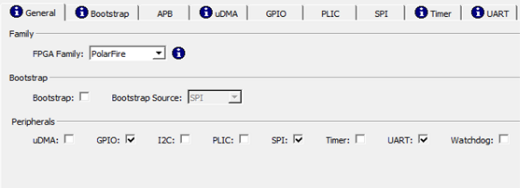
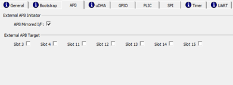
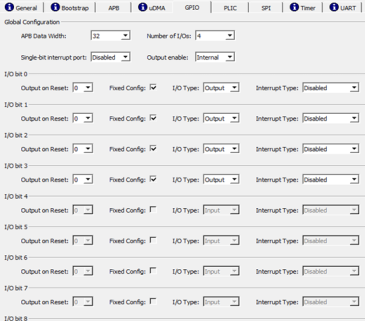
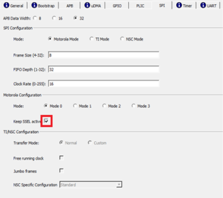
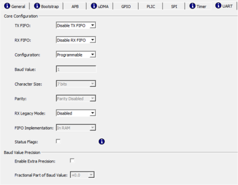
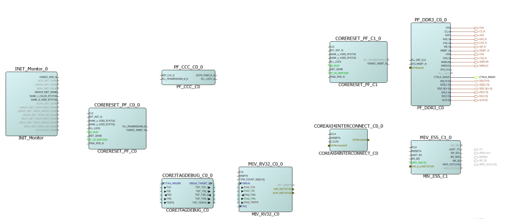

# Instantiating MiV ESS Core

To instantiate the MiV ESS core, perform the following steps:

1.  From the **Catalog**, drag the **MiV\_ESS IP** core to **SmartDesign**.
2.  In the **Create Component** dialog box, enter **MIV\_ESS\_C1** as the component name, and then click **OK**.
3.  In the **MiV ESS Configurator** screen, perform the following configurations:
    1.  Navigate to **General** tab, and make sure that the configurations are same as shown in the following figure.

        1.  Deselect **Bootstrap**.
        2.  Select the following peripherals: GPIO, SPI, and UART, and deselect all others.
        

    2.  Navigate to **APB** tab, and enable **APB Mirrored I/F** as shown in the following figure.

        

    3.  Navigate to **GPIO** tab, and make sure that the configurations are same as shown in the following figure.

        

    4.  Navigate to **SPI** tab, and check the option of **Keep SSEL active**. Make sure that the configurations are same as shown in the following figure.

        

    5.  Navigate to **UART** tab, and make sure that the configurations are same as shown in the following figure.

        

4.  To generate the component, click **OK**.

The following figure shows the top SmartDesign after all the components are instantiated.

**Parent topic:**[Instantiating IP Cores in SmartDesign](GUID-A1861753-3831-498C-B76D-F50D448A5B80.md)

