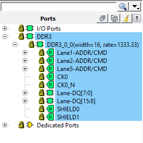

# Place and Route

The place and route process requires the following steps to be completed:

-   Selecting the already imported `io_constraints.pdc` file
-   Placing the PF\_DDR3\_C0\_0 block using the I/O Editor
-   Ensuring all the I/Os are locked

To perform place and route, follow these steps:

1.  Double-click **Manage Constraints** on the **Design Flow** tab.
2.  On the **I/O Attributes** tab, enable the check box next to the `io_constraints.pdc` file, as shown in the following figure. The `io_constraints.pdc` file contains the I/O assignment for reference clock, UART, GPIO, and SPI interfaces, and other top-level I/Os.

    

3.  From the **Edit** drop-down list, select **Edit with I/O Editor**, as shown in the following figure.

    

4.  In the I/O Editor, click the **Port View \[active\]** tab, and lock the CTRLR\_READY port to pin C27, as shown in the following figure. This ensures that the CTRLR\_READY port is assigned to pin C27, which is connected to an user LED for debug purposes.

    

5.  To place the DDR3 I/O lanes, in the I/O Editor Design View, click the Port tab in the left pane, and select **DDR3**, as shown in the following figure.

    

6.  Drag and place the DDR3 subsystem on the **NORTH\_NE** side, as shown in the following figure. The DDR3 memory on the board is connected to DDR I/Os present on the north-east side.

    

    The DDR3 subsystem is placed on the  **NORTH\_NE** side, as shown in the following  figure.

    

7.  From **I/O Editor Port View** tab, check if there are any unlocked I/Os, and lock them as mapped in the `io_constraints.pdc` file available in the `Design_Files_Directory\HW\src\constraints` folder.
8.  Click **Save**.
9.  Close the I/O Editor.

    A  `user.pdc` file is created for PF\_DDR3\_C0\_0 block in the **Constraint Manager** &gt; **I/O Attributes** and **Floor Planner** tabs.

    **Important:** PF\_DDR3\_C0\_0 can also be placed using the `fp_constraints.pdc`. Import the `fp_constraints.pdc` from **Constraint Manager** &gt; **Floor Planner** tab and select the place and route option after synthesis. This constraint file is available in the `Design_Files_Directory\HW\src\constraints` folder.

    When place and route is successful, a green tick mark  appears next to **Place and Route**.

10. Double-click **Place and Route** from the **Design Flow** tab.

    **Important:** The user has to enable the **High Effort Layout and Repair Minimum Delay Violation** option in the Place and Route settings to meet the timing requirements.

**Parent topic:**[Running the Libero Design Flow](GUID-89101F57-6885-421D-9881-42CA23E71A1B.md)

