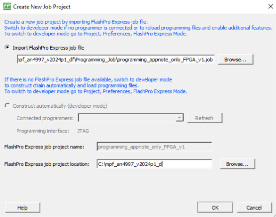
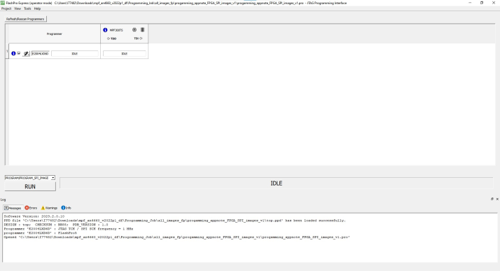
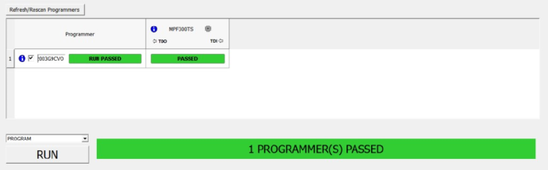

# Appendix 1: Programming the Device using FlashPro Express

This chapter describes how to program the PolarFire device with the Job  programming file using a FlashPro programmer. The default location of the  .`job` file is:  `mpf_an4997_df\Programming_files`

To program the PolarFire device using FP Express, perform the following steps:

1.  Ensure that the jumper settings on the board are the same as listed in [Table   1](GUID-64096F65-6A84-4B97-A532-8A57CBF867A3.md#ID-00000EA1).

    **Important:** Switch off the power supply while making the jumper connections.

2.  Connect the power supply cable to the J9 connector on the board.
3.  Connect the USB cable from the Host PC to the J5 \(FTDI port\) on the board.
4.  Power ON the board using the SW3 slide switch.
5.  On the host PC, launch the FlashPro Express software.
6.  To create a new job project, click **New** or select **New Job Project** from **Project** menu.
7.  Enter the following in the **Create New Job Project** dialog box:
    -   **Import FlashPro Express job file**: Click **Browse**, and navigate to the location where the `.job` file is located and select the file. The default location is: `<download_folder>\mpf_an4997_df\Programming_files`.
        -   `mpf_an4997_df\Programming_files\top_RevD`
        -   `mpf_an4997_df\Programming_files\top_RevF`
    -   **FlashPro Express job project location**: Click **Browse** and navigate to the location where you want to save the project.

        

8.  Click **OK**. The required programming file is selected and ready to be programmed in the device.
9.  The FlashPro Express window appears as shown in the following figure. Confirm that a programmer number appears in the Programmer field. If it does not, confirm the board connections and click **Refresh/Rescan Programmers**.

    

10. Click **RUN**. When the device is programmed successfully, a **RUN PASSED** status is displayed as shown in the following figure.

    

11. Close **FlashPro Express** or in the **Project** tab, click **Exit**.

