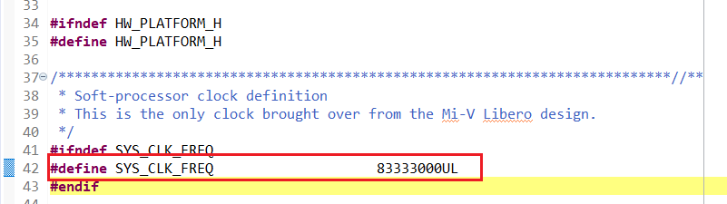

# Setting the UART Baud Rate

The value of the `BAUD_VALUE_115200` macro in the `hw_platform.h` file must be defined according to the system clock frequency to achieve the UART baud rate of 115200. The baud value is calculated using the following formula.

BAUD\_VALUE = \(CLOCK / \(16 \* BAUD\_RATE\)\) - 1

To define the system clock frequency:

Look for `#define SYS_CLK_FREQ` statement in the `hw_platform.h` file.

Define it as:

`#define SYS_CLK_FREQ 83333000UL`

The SYS\_CLK\_FREQ value must be same as that of the clock generated in the design.

The following figure shows the system clock frequency definition.

**Parent topic:**[Building the User Application Using SoftConsole](GUID-C680D538-D263-4D33-B37A-DB0AD0011184.md)

