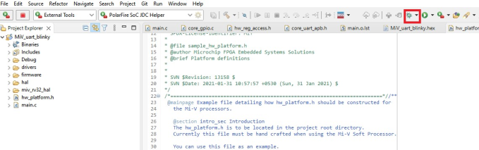
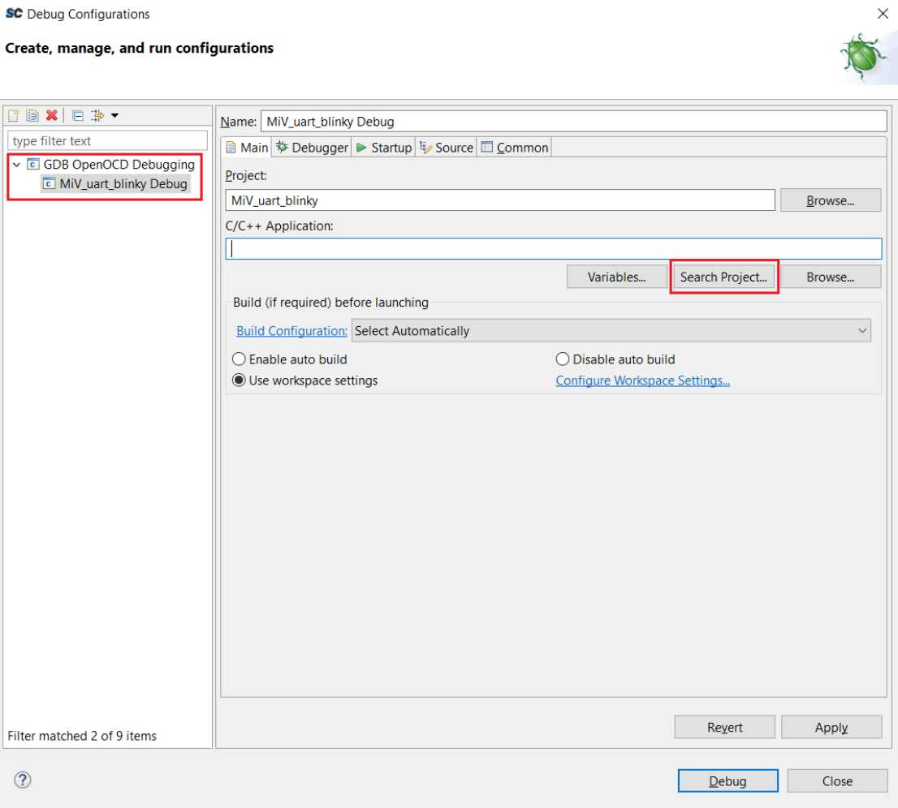
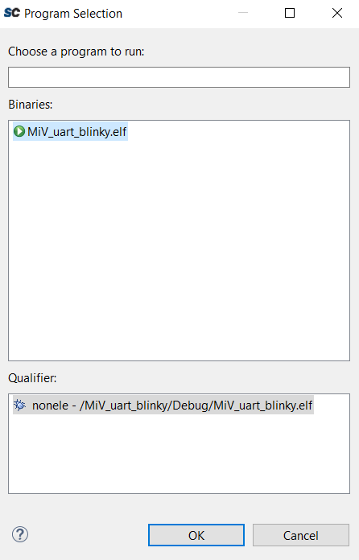
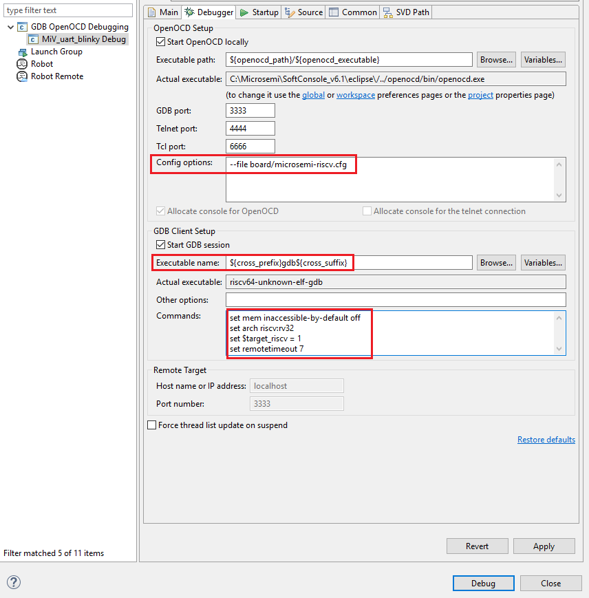
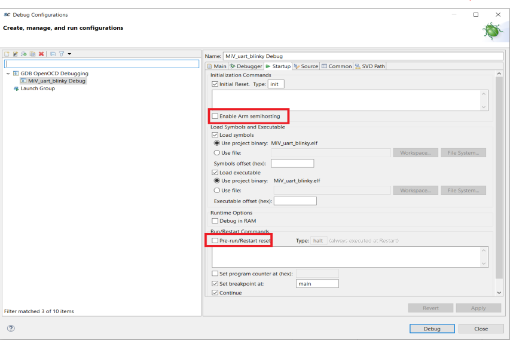
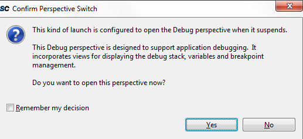
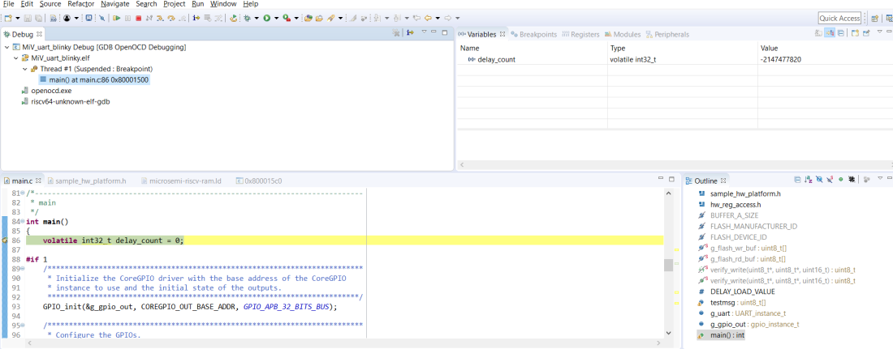
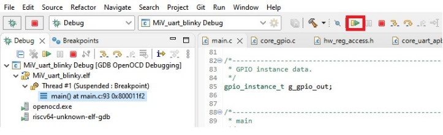
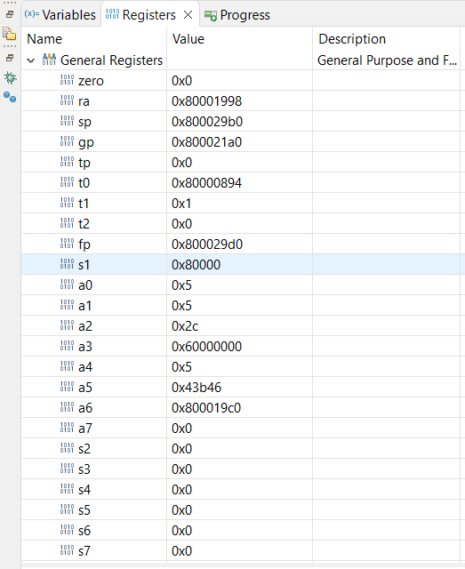
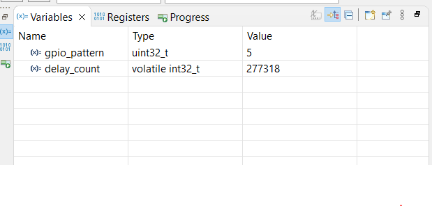

# Debugging the User Application Using SoftConsole

Before debugging, the board and the serial terminal must be set up. For more information about the board and serial terminal setup, see [Board Setup](GUID-64096F65-6A84-4B97-A532-8A57CBF867A3.md) and [Serial Terminal Emulation Program \(PuTTY\) Setup](GUID-1BD8BCF9-1049-4D3E-8A1A-EA9C38080389.md).

To debug the application, perform the following steps:

1.  From the **Project Explorer**, select the **MiV\_uart\_blinky** project, and then click the **Debug** icon from the SoftConsole toolbar, as shown in the following figure.

    

2.  In the **Create**, **manage, and run configurations** window, double-click**GDB OpenOCD Debugging** to generate the debug configuration for the **MiV\_uart\_blinky** project.
3.  Select the generated **MiV\_uart\_blinky Debug** configuration, and click **Search Project** \(if by default not available\), as shown in the following figure.

    

4.  Select the **MiV\_uart\_blinky.elf** binary from the **Program Selection** window, and click **OK**, as shown in the following figure.

    

5.  Go to the **Debugger** tab, and replace the **Config options**, **Executable name**, and **Commands** as follows:
    -   Config Options: `--file board/microsemi-riscv.cfg`
    -   Executable name: `${cross_prefix}gdb${cross_suffix}`
    -   Commands:

        ``` {#CODEBLOCK_U4R_4KV_PXB}
        set mem inaccessible-by-default off
        ```

        ``` {#CODEBLOCK_EGD_PKV_PXB}
        set arch riscv:rv32
        ```

        ``` {#CODEBLOCK_ZPL_PKV_PXB}
        set $target_riscv = 1
        ```

        ``` {#CODEBLOCK_Y25_PKV_PXB}
        set remotetimeout 7
        ```

        

6.  In **Debug Configurations** &gt; **Startup** tab, clear the **Pre-run/Restart reset** check box to halt the program at the main \(\) function, and clear the **Enable ARM semihosting** check box.

    

7.  Click **Apply**, and then click **Debug**, as shown in the preceding figure.

    The **Confirm Perspective Switch** dialog opens, as shown in the following figure.

    

8.  Click **Yes**.

    The debugger halts the execution at the first instruction in the `main.c` file, as shown in the following figure.

    

9.  On the SoftConsole toolbar, click the **Resume** icon to resume the application execution, as shown in the following figure.

    

10. The string *Hello World!* is printed on the serial terminal, as shown in the following figure. Also, LEDs 4, 5, 6, and 7 on the PolarFire Evaluation Board blink.

    

11. On the SoftConsole menu, click **Run** &gt; **Suspend** to suspend the execution of the application.
12. Click the **Registers** tab to view the values of the Mi-V internal registers, as shown in the following figure.

    

13. Click the **Variables** tab to view the values of variables in the source code, as shown in the following figure.

    

14. From the SoftConsole toolbar, use the **Step Over** option to view the application execution line by line, or use the **Step Into** option to execute the instructions inside a function. Use the **Step Return** option to come out the function. You can also add breakpoints in the application source code.
15. On the SoftConsole toolbar, click **Terminate** to terminate the debugging of the application.
16. Close PuTTY and SoftConsole.

**Parent topic:**[Building the User Application Using SoftConsole](GUID-C680D538-D263-4D33-B37A-DB0AD0011184.md)

