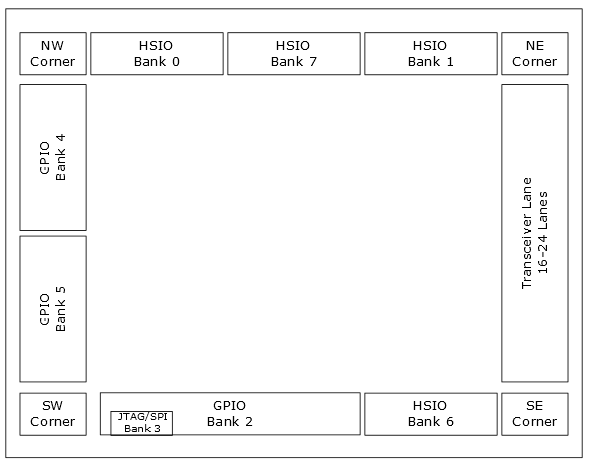
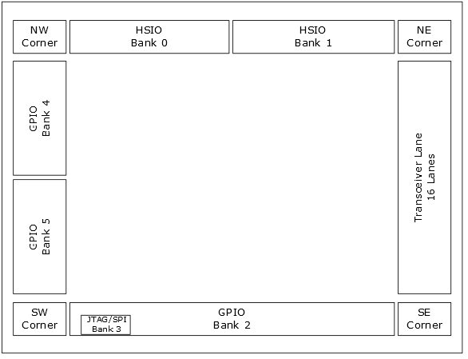
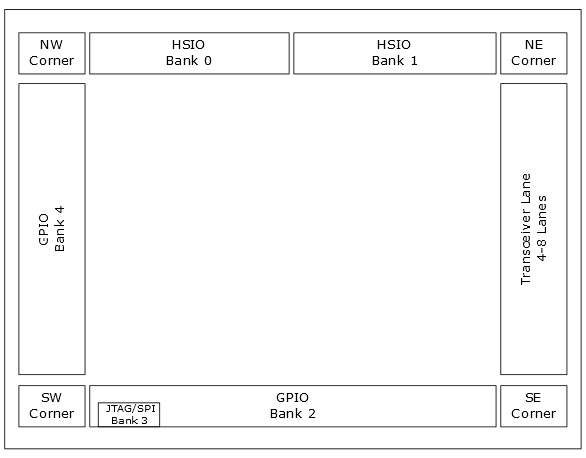
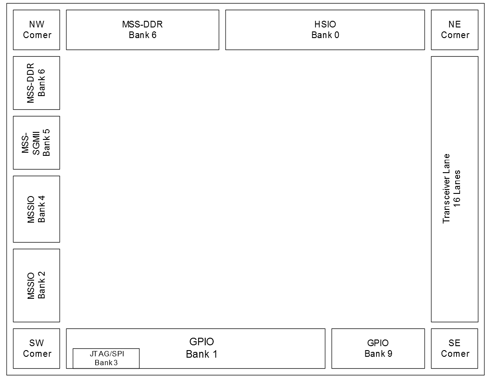
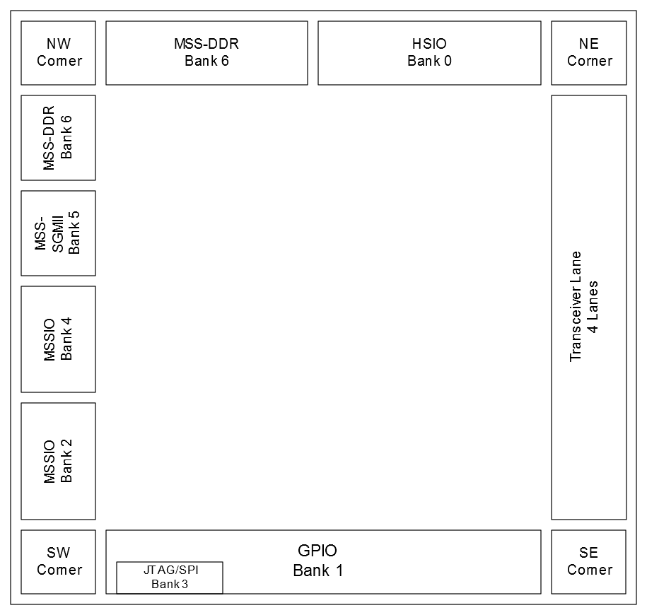
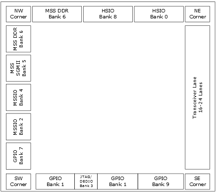
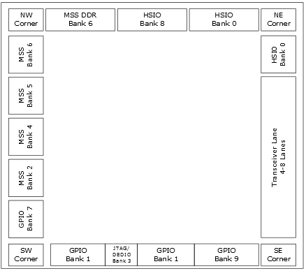
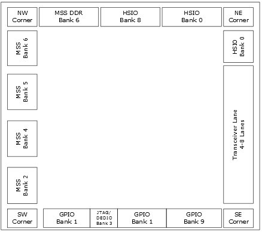
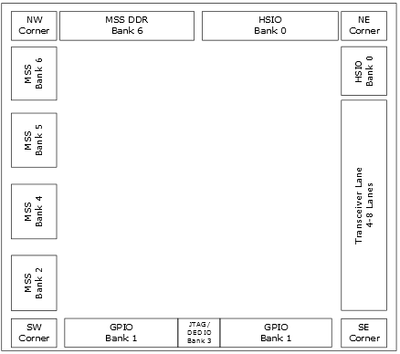

# PolarFire Family I/O Banks

PolarFire SoC and RT PolarFire SoC FPGA devices have eight user I/O banks,  whereas PolarFire and RT PolarFire FPGA devices have five, six, or eight user I/O banks  depending upon the device size. In PolarFire SoC and RT PolarFire SoC FPGA devices, the  banks assigned to the MSS are only for dedicated use with the MSS block and are not  accessible to the FPGA fabric. MSS\_DDR, MSS\_IO, MSS\_SGMII, and MSS\_REFCLK are only used  with MSS block. For information about MSS bank, see [PolarFire SoC FPGA Packaging and Pin Descriptions User Guide](https://ww1.microchip.com/downloads/aemDocuments/documents/FPGA/ProductDocuments/UserGuides/microchip_polarfire_soc_fpga_packaging_and_pin_descriptions_user_guide_vb.pdf).

The I/O banks on the north side of the device support only HSIO. Each I/O bank has dedicated I/O supplies and grounds. Each I/O within a given bank shares the same VDDI power supply and VREF reference voltage. Only compatible I/O standards can be assigned to a given I/O bank.

Each bank contains a bank power detector and a bank receiver reference voltage generator to create an internally generated reference voltage, VREF. Each bank also interfaces with a PVT controller to calibrate the I/O buffer output driver strengths and termination values \(needed only for certain I/O standards\). The PVT controller generates a set of codes to control the source driver and the sink driver, and also calibrates the HSIO output slew. Each I/O buffer has individual drive-strength programmability to multiply the PVT digital code value by a drive setting to create the desired drive, impedance, or termination settings. For more information, see [I/O Analog \(IOA\) Buffer Programmable Features](GUID-CC29CF66-77AD-471C-8A06-94A7337826B5.md).

[Figure   1](#GUID-D9C2332F-D163-483D-BAA1-2EAFEB1F7340) through [Figure   5](#GUID-69808E93-3F8B-4BCB-A352-488733EEF9E7) show simplified  floor plans for each device, including the bank locations. These figures also show the  corner block and transceiver block. The corner block includes CCCs, two PLLs, and two  DLLs each, providing flexible clock management and synthesis for the FPGA fabric,  external system, and I/Os. All banks are not available in all devices, see [I/O Lanes in Each Bank](GUID-2227C38D-7FCE-4A20-9B53-28D953767052.md) for more  information. For more information about CCC and transceivers, see [PolarFire Family Clocking Resources User Guide](https://ww1.microchip.com/downloads/aemDocuments/documents/FPGA/ProductDocuments/UserGuides/Microchip_PolarFire_FPGA_and_PolarFire_SoC_FPGA_Clocking_Resources_User_Guide_VB.pdf) and [PolarFire Family Transceiver User Guide](https://ww1.microchip.com/downloads/aemDocuments/documents/FPGA/ProductDocuments/UserGuides/PolarFire_FPGA_and_PolarFire_SoC_FPGA_Transceiver_User_Guide_VB.pdf).

