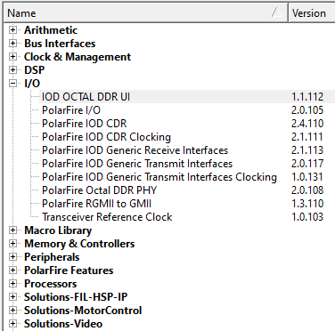
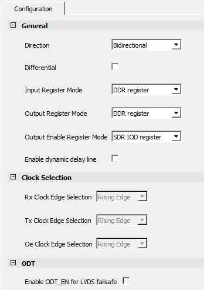

# Basic I/O Configurator - PF\_IO

A basic I/O configurator is available in the Libero SoC catalog. It is capable  of building simple I/O macros. For information about I/O macros,  see [PolarFire FPGA and PolarFire SoC FPGA Macro User Guide](http://coredocs.s3.amazonaws.com/Libero/2025_1/Tool/pf_mlg.pdf).

The I/O configurator uses a single tab GUI for configuring the I/O component. The GUI includes a symbol depiction of the macro as configured by the user.

The Direction pull-down allows selection of Bidirectional, Input, Output, and  Tribuf. It has a checkbox for selection of single-ended or  differential I/O. The configurator does not provide the  capability to choose a specific I/O standard. You must use the  IO Editor or PDC to pick an associated single-ended or  differential standard.

A Register Mode pull-down allows selections of non-registered, SDR registered, or DDR registered interfaces. Non-registered modes generate simple I/O buffer components. Registered modes construct simple registered interfaces by adding SDR or DDR resources to the input, output, or bidirectional. This capability is for simple DDR applications. With the I/O Configurator, DDR modes uses IOD elements to construct DDR1X configurations without the low-skew clock management capabilities. For information about DDR1X waveform, see [Figure   1](GUID-674B424B-F06C-4D28-B6E5-BE14BD2E5C47.md#GUID-1580E78C-238E-4889-B580-3565610B182D) and [Figure   1](GUID-9D6774C0-A389-417E-92EF-B653751EE7D5.md#GUID-B9141512-F4E7-41D0-88F5-6E1A3B875D14). For source-synchronous designs, you must target IOD interfaces, which includes low-skew clock management. See [I/O Interface Configurators](GUID-CF8CE51A-E6C4-4DEC-A91C-21C8A04E9A8C.md).

The **Enable dynamic delay line** check box selection adds  the capability to control the delay chain structure in the input or output paths. By default,  this is not enabled. The fast path from the input or output buffer is used. When enabled  \(checked\), the component includes the delay logic and controls for fabric hosted IP to control  the tuning of the path.

The **Clock Selection** pane allows the user to select clock inversion for  the Input, Output, and Output Enable registers in the SDR register mode. In the  **Clock Selection** pane, the **Rx Clock Edge Selection**, **Tx Clock Edge Selection**, and **Oe Clock Edge Selection** drop-down options are provided to select data sampling on  either rising edge or falling edge of the clock.

The **Enable ODT\_EN for LVDS failsafe** check box exposes an  enable port to differential input macros. This enable pin is used in conjunction with the  capability to dynamically enable/disable the ODT resistor when needed for applications such as  fail-safe LVDS.

**Parent topic:**[Generic IOD Interface Implementation](GUID-8222AB9C-2F29-47B9-8E42-AF75F97A64B1.md)

