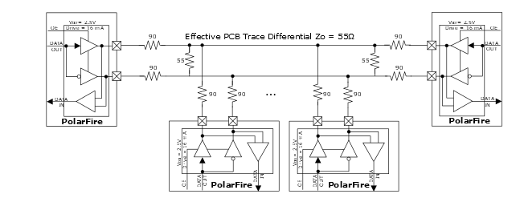

# Bus-LVDS Emulated \(BLVDSE25\) Output Mode

BLVDS is used in multipoint, bidirectional, and heavily-loaded backplane  applications. The effective impedance of these systems is lower  than a typical pair of PCB traces due to the backplane  capacitance, the connectors on the backplane, and the line  stubs. The following illustration shows an example of BLVDS  implementation using 90Ω stub resistors at every drop and 55Ω  stub resistors on either side of the bus. The termination values  at the end of the bus, which can range anywhere between 45Ω and  90Ω, must be optimized through PCB design simulations to match  the effective differential impedance of the bus. In this  example, the two parallel 55Ω stub discrete termination  resistors yield an effective 27Ω differential termination.

**Parent topic:**[Implementing Emulated Standards for Outputs](GUID-CEDCE521-84AB-4ACB-9B30-7E70F1D7BAB1.md)

