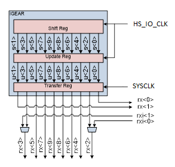
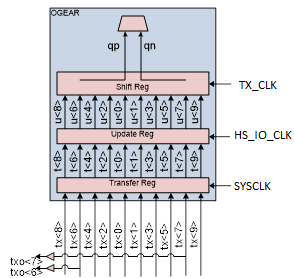
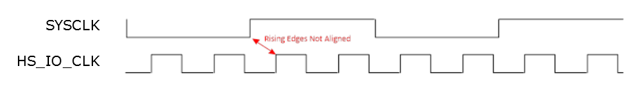
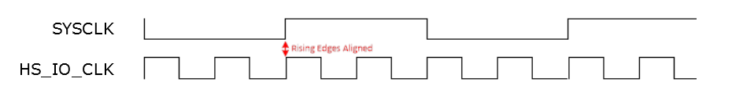

# HS\_IO\_CLK and System Clock Training

IOD interfaces implement Input gearing, de-serialization of the high-speed pad signals to lower speed parallel core signals, and the clock domain transfers, as required for the specific interface. The IOD implements a clock domain transfer for the data from the high-speed \(HS\_IO\_CLK\) to the low-speed system clock \(SYSCLK\) which is either GLOBAL or REGIONAL clock of the IOD macro. IOD Rx data is transferred from the Update Register \(HS\_IO\_CLK domain\) to the Transfer Register \(SYSCLK\) domain in the IGEAR logic. HS\_IO\_CLK and system clock training is implemented with interfaces where the data rate is greater than or equal to 400 Mbps, ratio 2, 3.5, 4. Interfaces using ratio x5 does not require HS\_IO\_CLK to system clock training because of its higher ratio which already provides adequate margin between them.

The Input IREG gearing logic data path uses three sets of registers to  move the data between the domains. The following registers are depicted in [Figure   1](#GUID-0A06D654-36C2-4D22-8210-CD6AE1F96BE7).

-   Shift register
-   Update register
-   Transfer register

Similarly, IOD Tx data is transferred from the Transfer Register \(SYSCLK  domain\) to the Update Register \(HS\_IO\_CLK domain\) in the OGEAR logic using a same domain  transfer topology.

The HS\_IO\_CLK and SYSCLKs can have different insertion delays due to  dissimilar routing paths within the fabric. This causes the rising clock edges to be  misaligned potentially causing timing mismatches when the rising edges of these clocks are  not aligned.

In the [Figure   3](#GUID-AF71FCC1-AFF9-40AB-A13A-4055C66EBD63) and [Figure   4](#GUID-EF96415A-923C-47AD-80C4-2DAB2C93E702), a PLL VCO phase adjustment for the HS\_IO\_CLK is required to align the  rising edges of System clock and HS\_IO\_CLK for best performance. It requires use of the  data EYE\_MONITOR of an unused/spare IOD lane to derive the best setting. Upon completion,  the CLK\_TRAIN\_DONE output indicates that the training is successful. CLK\_TRAIN\_ERROR  indicates an error causing the HS\_IO\_CLK and system clock not to train. This can occur when  the clocks are interrupted. CLK\_TRAIN\_ERROR is not available with fractional  interfaces.

Clock training occurs automatically at power-up or the assertion of DEVRST\_N for both Tx  and Rx IODs in designs that include clock training IP. Tx IOD clock training aligns the  fabric global clock and HS\_IO\_CLK outputs of the PF\_IOD\_TX\_CCC to compensate for CCC/IOD  routing variations within the fabric. Retraining can be manually invoked by asserting the  CLK\_TRAIN\_RESTART input of the PF\_IOD\_TX\_CCC.

**Parent topic:**[Clock to Data Margin Training](GUID-48F18460-37DB-4F9C-A454-A838B1B2C4ED.md)

