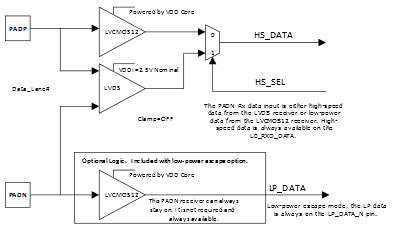

# MIPI D-PHY Receive Interface

GPIO supports unidirectional MIPI D-PHY I/O in the receive direction, as shown in the following illustration. The MIPI D-PHY receiver supports high-speed \(HS\) signaling mode for data traffic and low-power \(LP\) signaling mode used for control. Each HS lane using MIPI25 is terminated and driven by a low-swing, differential signal. LP lanes operate single-ended and not terminated using two MIPI25 outputs driving each connection of the lane independently.

The MIPI receiver supports both the high-speed \(HS\) and a low-power \(LP\)  receiver modes. These modes are selectable through an enable \(HS\_SEL\) from the IOD  component when MIPI low-power escape support is selected in the IOD Generic Receive  Interfaces configurator \(See [Figure   1](GUID-70A2AF8E-A06D-4A0E-8D99-02A9F2783D1E.md#GUID-AA04BA8A-57AE-4A3A-91C6-B697E128DAA8)\).

When the MIPI25 low-power escape support is used, the I/O is generated with a  differential receiver between PADP and PADN. An additional single-ended receiver is  connected to the PADP, allowing the HS\_SEL signal to select between receivers. It also  enables the 100Ω differential termination resistor when HS\_SEL = 1. This is generated by  Libero SoC when selected in the IOD configurator.

When HS\_SEL is selected, the HS\_SEL pin serves as the output enable. When HS\_SEL  = 1, then the HS differential receiver and differential 100Ω termination is turned ON  and a single-ended receiver connected to the compliment PADN pin. When HS\_SEL = 0, the  differential termination is disabled and the single-ended receiver is enabled on the  PADN pins. This MIPI interface is implemented by configuring PADP as a MIPI receiver,  PADN pin and LVCMOS12 receiver. FPGA hosted logic is required to control this  feature.

FPGA fabric synchronization registers are required when clocking LP\_DATA  with RX\_CLK\_R of the IOD to ensure clean capture of the data.

**Note:** Low-power LVMOS12 inputs are powered by internal VDD core. VDDI is not used with Low-power LVCMOS12 inputs.

**Note:** For Low-power detection of MIPI, HS\_SEL can be tied to Logic one.

**Parent topic:**[Implementing MIPI D-PHY](GUID-01A145E0-6FFC-412D-8258-FBEB32C25B55.md)

