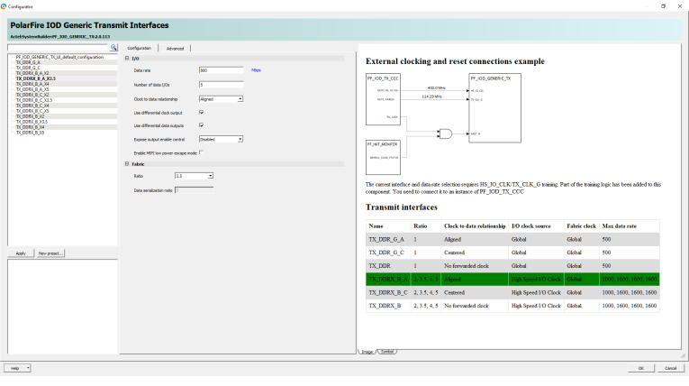
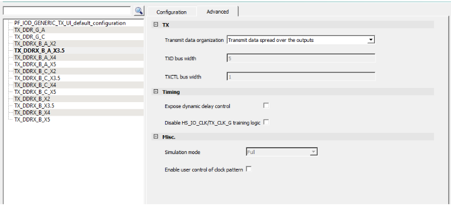

# 7:1 LVDS Transmit Interface

The transmit block uses double data rate registers of the TX\_DDRX\_B\_A\_X3.5 to transmit data on both the rising and falling edges of the clock. It multiplies the parallel clock by 3.5 and uses the clock to transmit seven serial bits of data in one parallel clock cycle and serialize the data into a single LVDS data stream. HS\_IO\_PAUSE needs to be pulsed after the clocks are stable. This forces all gearbox to be framed in the same cycle \(including the one used to generate the clk\). This assures synchronization of the data word. Word starts with the rising edge of the forwarded fractional clock.

**Parent topic:**[LVDS 7:1](GUID-F8878616-7DDC-4EC3-A0F4-A77EEC61E198.md)

