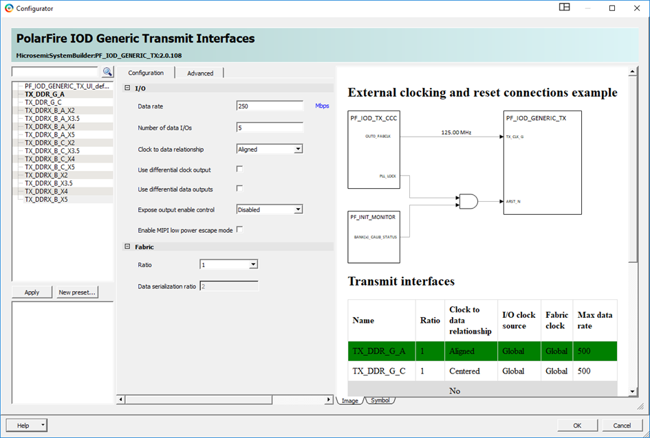
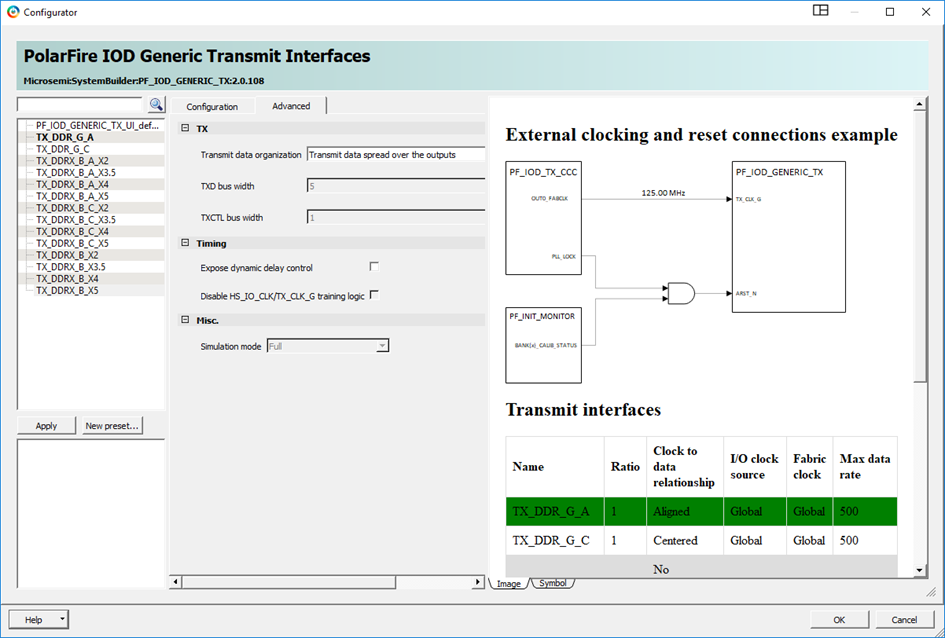

# IOD Generic TX

The following table lists the transmit interface software names and their related data.

|Software Name|Ratio|Clock to Data Relationship|I/O Clock|Fabric Clock|Max Data Rate \(Mbps\)|
|-------------|-----|--------------------------|---------|------------|----------------------|
|TX\_DDR\_G\_A|1|Aligned|Global|Global|500|
|TX\_DDR\_G\_C|1|Centered|Global|Global|500|
|TX\_DDR|1|No forwarded clock|Global|Global|500|
|TX\_DDRX\_B\_A|2, 3.5, 4, 5|Aligned|High-speed I/O Clock|Global|1000, 1600, 1600, 1600|
|TX\_DDRX\_B\_C|2, 3.5, 4, 5|Centered|High-speed I/O Clock|Global|1000, 1600, 1600, 1600|
|TX\_DDRX\_B|2, 3.5, 4, 5|No forwarded clock|High-speed I/O Clock|Global|1000, 1600, 1600, 1600|

The following figure shows the IOD Generic Transmit Interfaces configurator.

|GUI Option|Selections|
|----------|----------|
|Data rate|User Input[1](#ID-0000356F)|
|Number of data I/Os|User Input|
|Clock to data relationship|Aligned, Centered, No Forwarded Clock|
|Use differential clock output|Disable \(single-ended\) and Enabled \(differential\)|
|Use differential data outputs|Disable \(single-ended\) and Enabled \(differential\)|
|Enable MIPI low power escape mode|Enable/Disable|
|Ratio|1, 2, 3.5, 4, 5|
|Data Serialization Ratio|Derived from the ratio setting|
|\(1\) See Transmit  Interface \(right panel\) for valid data rates \([Figure   1](#GUID-83B404DF-E3EE-49A9-9629-902E95CB3E83)\).| |

<table id="ID-00003579"><thead><tr id="ID-00003581"><th id="ID-00003582">

GUI Option

</th><th id="ID-00003584">

Selections

</th></tr></thead><tbody><tr id="ID-00003587"><td id="ID-00003588">

Transmit data organization

</td><td id="ID-0000358A">

  -   Transmit data spread over outputs with data/Control split: X I/Os are associated to data and N-X I/Os to control that means it is arranged to have two data buses on the fabric side \(one for data and one for control\).
-   Transmit data spread over outputs: On the fabric, it is arranged as one wide bus. This arrangement means all rising edge of all I/Os, all falling edge of all I/Os, all rising edge+1 of all I/Os, and so on.
-   Transmit data independent over outputs: It is one data bus per I/O.

 

</td></tr><tr id="ID-0000358C"><td id="ID-0000358D">

TXD bus width

</td><td id="ID-0000358F">

This allows organizing the splitting of the data bus.

</td></tr><tr id="ID-00003591"><td id="ID-00003592">

TXCTL bus width

</td><td id="ID-00003594">

This allows organizing the splitting of the data bus.

</td></tr><tr id="ID-00003596"><td id="ID-00003597">

Expose dynamic delay control

</td><td id="ID-00003599">

Disable and Enable. See [Table   1](GUID-57F1B703-45B4-4461-92AB-0152A550919C.md#ID-0000346A).

</td></tr><tr id="ID-0000359D"><td id="ID-0000359E">

Simulation mode

</td><td id="ID-000035A0">

Full

</td></tr><tr><td>

Enable User Control of Clock Pattern

</td><td>

When enabled, this provides two top-level input ports to the  TX IOD macro, which can be used to provide option to transmit parallel clock  synchronously with data.

</td></tr><tr><td>

PF\_IOD\_TX\_CCC

</td><td>

  A dedicated PF\_IOD\_TX\_CCC is specifically incorporated in the IOD transmit  solution. When using a TX\_CCC for multiple IOD generic TX, it requires two  IOD generic TX components.  -   One component with the training logic that is instantiated only once. And
-   another component, with the training logic turned off. This option is available in the **Advanced** tab of the PF IOD Generic Transmit Interface UI. The second component can be instantiated as required.

 

</td></tr></tbody>
</table>**Important:** Post layout simulation of the IOD is not supported.

**Parent topic:**[I/O Interface Configurators](GUID-CF8CE51A-E6C4-4DEC-A91C-21C8A04E9A8C.md)

