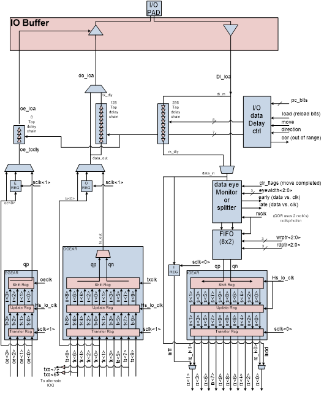
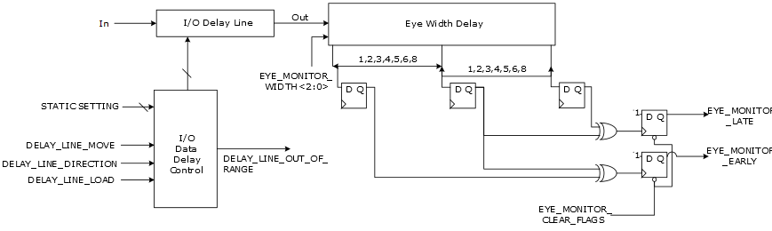

# Clock to Data Margin Training

Margin control training of the IOD interface maximizes the valid window by  continuously monitoring and controlling the delays using the dynamic delay control signals.  This operation is used to compensate for the PVT variations with high-speed source  synchronous interfaces. The main reason for this capability is to optimize the signal  integrity of the high-speed IOD interfaces by maintaining margin between the data and clock  paths. Interface training is controlled and monitored by FPGA hosted IP \(that is, Training  IP or TIP\).

The TIP uses the dynamic delay control pins of the dynamic RX\_DDRX interface components to optimize the receive relationship between the clock and data. Status flags are used to dynamically monitor the relationship of the clock and data at the IREG and uses dynamic controls to adjust the delay chain by adding or removing delay elements in the data path. The delay setting is adjusted to move the data edges earlier or later relative to the clock edges. This feature monitors the relation of the data edges to both the positive and negative clock edges.

FPGA fabric hosted logic is used to control and monitor IOD signals to perform adaptive tuning functions on a bit- or word-wide basis. Bit alignment is the alignment of the data to be 90 degrees centered from the clock edges. This is a physical layer function that is independent of the data or protocol being used. This step requires the transmitter to send data \(with transitions\) and has a static alignment with the forwarded clock.

RX\_DDRX\_DYN macro provides controls to add or remove delay from the data path relative to the clock path. The RX\_DDRX\_DYN also provides flags using the eye monitor which can identify when the data and clock are too close together and side of the clock in which the violation occurs. Using these controls and flags, bit alignment can be performed by only looking at the physical layer.

Word Alignment is the alignment of the fabric presented word to a specific  pattern. The RX\_DDRX\_DYN provides I/O gearing and supports both a 4-bit and 8-bit fabric  width. Byte alignment is data pattern dependent and would require a training pattern. When  the transmitter sends the training pattern, a pattern detector in the FPGA fabric would use  the Lx\_BITSLIP port on the RX\_DDRX\_DYN to rotate the fabric word till the training pattern  is found.

The signal, “DELAY\_LINE\_LOAD” asynchronously reloads the initial static  Flash bit delay settings that are predefined by Libero SoC. The signal, “DELAY\_LINE\_MOVE”  uses a rising edge to change the delay setting by ±1 increment each time it is pulsed  according to the “DELAY\_LINE\_DIRECTION” signal value \(a “1” increases up the delay setting  by 1 increment and a “0” decreases down the delay setting by 1 increment\). When the delay  setting reaches the minimum value or the maximum value of the delay chain, the delay chain  controller generates an out of range output Flag “DELAY\_LINE\_OUT\_OF\_RANGE” to indicate that  it has reached the end of the delay chain. The delay setting stops at this minimum or  maximum setting, even if the “DELAY\_LINE\_MOVE” signal is still pulsing. Toggling the  HS\_IO\_PAUSE does not disrupt delay line value settings.

The IOD block has a Data Eye Monitor \(DEM\) used to optimize the clock and  input data relationship. The data eye monitor \(DEM\) and its associated flags are not  available to IOD interfaces using a gearing ratio of 1. The DEM includes EYE\_MONITOR\_EARLY  and EYE\_MONITOR\_LATE flags used to analyze the clock-to-data relationship. IOD designs can  utilize these flags to determine the input data edge relationship to the clock edge. The  design can then use the DELAY\_LINE control inputs to dynamically adjust this relationship  to optimize the clock and data relationships until an optimal setting is found.

Similarly, output delays are affected when the IOD tri-state enable “E” = 1 or the input delay “E” = 0. The DELAY\_LINE\_MOVE is applied to the output delay path.

The Data Eye Monitoring \(DEM\) is accomplished as follows:

-   Use the input signals “EYE\_MONITOR\_WIDTH&lt;2:0&gt;” to set a minimum delay space requirement between the data edges and the clock edges. The programmable delay settings are programmed in delay increments of 1 to 128 taps. This delay setting is then used to generate EYE\_MONITOR\_EARLY and EYE\_MONITOR\_LATE flag if the data edges are closer to the clock edges than this minimum setting. By allowing these signals to be dynamically controlled from the FPGA hosted logic, the user can determine the relative size of the eye opening.
-   EYE\_MONITOR\_EARLY is asserted if the data edge is too close to the clock edge on the early side of clock. This Flag indicates that the delay setting must be moved down \(decremented\).
-   EYE\_MONITOR\_LATE is asserted if the data edge is too close to the clock edge on the late side of clock. This Flag indicates that the delay setting must be moved up \(incremented\).
-   Use the “EYE\_MONITOR\_CLEAR\_FLAGS” input signal, from the fabric, to clear the “EYE\_MONITOR\_EARLY” and “EYE\_MONITOR\_LATE” Flags. This signal is from the fabric and indicates that the delay chain setting has been incremented or decremented as a function of the previous Flag settings.

-   **[HS\_IO\_CLK and System Clock Training](GUID-189BB03C-9B39-4920-A246-87AA79EAB04F.md)**  

**Parent topic:**[Dynamic IOD Interface Training](GUID-78782CBA-B102-43F0-809A-790406FCEFC8.md)

