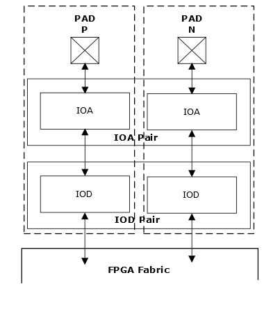

# I/O Overview

Each I/O is composed of an analog I/O buffer \(referred to as IOA\) and a digital logic block \(referred to as IOD\). IOA blocks include analog input and output buffers, while IOD blocks include a logic that enables the IOA buffer to interface with the FPGA fabric. The IOD also includes data bus digital logic to widen the bus to and from the IOA, allowing the external pins to run at a much faster clock rate than the fabric logic.

To support a variety of I/O standards, I/Os are organized into pairs, as shown in the following illustration. The two I/O paths in a pair, labeled as positive \(P\) and negative \(N\) respectively, can be configured as two separate single-ended I/Os, as one differential or as a complementary I/O pair.

The IOA buffer includes a transmit and receive buffer, on-die termination \(Thévenin, differential, up, and down\), a slew-rate control circuit, a bus-keeper circuit, and a programmable weak pull-up or pull-down resistor. The transmit and receive buffers transfer signals between the I/O pad and the IOD. [Figure   1](GUID-15B2CA6C-8B5E-4D24-A89D-33DDF52325F5.md#GUID-E27E15D7-709E-4775-8314-324711382F05) shows the overview of IOA buffer.

-   **[Single-Ended Transmitter and Receiver Mode](GUID-9F4E4305-D223-44F9-AD2E-511C6254F3EF.md)**  

-   **[Differential Transmitter Mode](GUID-675FA7C7-995C-4A71-A085-EF6C256E5051.md)**  

-   **[Differential Receiver Mode](GUID-921913B7-B68B-4816-80B9-F0E9E4C91F27.md)**  

-   **[I/O Digital \(IOD\)](GUID-FCDE3A68-38A2-4B9B-80EB-A856E5842715.md)**  

