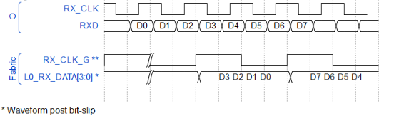

# RX\_DDRX\_B\_G\_C and RX\_DDRX\_B\_G\_A/RX\_DDRX\_B\_R\_A Interfaces with Static Delays

RX\_DDR interfaces can use x2, x3.5, x4, and x5 gearing using bank and lane oriented, high-speed I/O clock networks that provide low-skew, clocks distributed along the edge of the device to service the I/Os. Used to clock data into the I/O logic when implementing the I/O interfaces, the clocks are tightly managed to support wide source synchronous interfaces. The clock domain transfer for the data from the high-speed IO clock to the low-speed system clock is guaranteed by design. These modes permit wider data transfers to the fabric hence achieving more data throughput with lower fabric clock transfers.

The RX\_DDRX\[2,3.5,4,5\]B\_G\_A/\_B\_R\_A and RX\_DDRX\[2,3.5,4,5\]B\_G\_C interfaces are also supported by static settings when the user is aware of the input and clock relationship at the boundary of the device. Similar to the RX\_DDRX1 interfaces, the Libero SoC IOD configurator creates a component that meets the gearing criteria and is correct by construction from the pads to the fabric interface making use of the correct input pins required for clock and data. For each high-speed input receiver, the component is generated with the appropriate fabric pins based on the gearing ratio. For example, if a single high-speed input is intended to be geared by 4, then the component has 8 pins. The 8-pins has a relative pin name LN0\_RXD\_DATA\[7:0\] where as \[0:1\], \[2:3\], \[4:5\], \[6:7\] are the DDR equivalent for x4 geared data to the fabric.

The precise granularity of the embedded IOD block architecture limits the controllable  impact that the software place and route process can have on timing results. The timing  through the elements of the IOD blocks are guaranteed by construction across the process,  voltage, and temperature range that is specified in the data sheet. Users must not perform  any additional worse case timing analysis on the IOD paths associated with the embedded  high-speed clocks and related elements of the IOD blocks. If attempted, the timing analysis  algorithms computes overly pessimistic IOD expectations that does not accurately portray  the actual device performance.

-   **[Interface Ports](GUID-D5FF1F14-7586-4A49-8E04-D7C69E2F688E.md)**  

-   **[Interface Selection Rules](GUID-842F756F-C725-4B27-9D7D-84D22FEF9C02.md)**  

**Parent topic:**[Generic I/O Interfaces](GUID-A63099D1-2595-43B7-B69C-1ABB1F7E412A.md)

