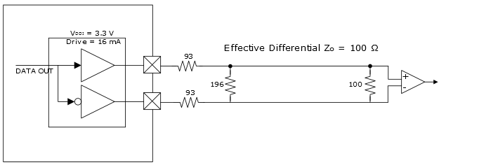

# LVPECL Emulated \(LVPECLE33\) Output Mode

LVPECL is derived from ECL and PECL and uses 3.3V supply voltage. The  following illustration shows an example of implementation using 93Ω stub resistors with a  196Ω parallel/differential termination at the driver and a 100Ω differential termination at  the receiver. The termination values at the driver must be optimized to match the effective  differential impedance of the bus. In this example, the effective parallel differential  termination at the receiver is around 66Ω. However, the series 93Ω resistors are always  seen by the driver yielding an effective differential impedance of 252Ω. The receivers see  an attenuated signal.

**Parent topic:**[Implementing Emulated Standards for Outputs](GUID-CEDCE521-84AB-4ACB-9B30-7E70F1D7BAB1.md)

