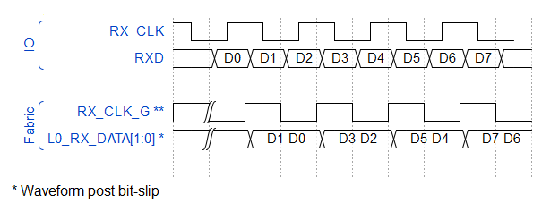
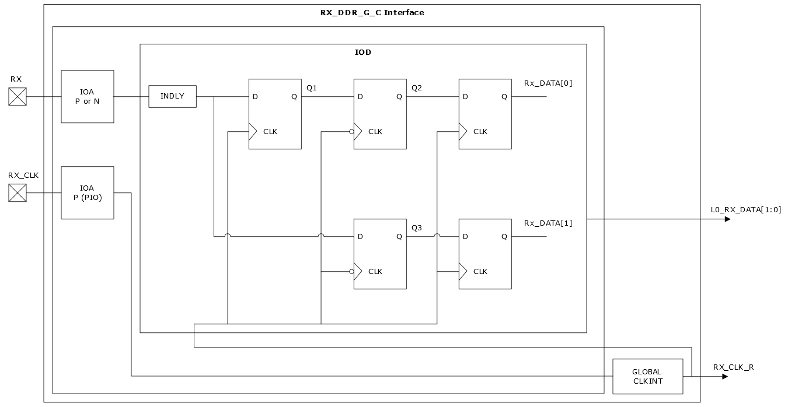
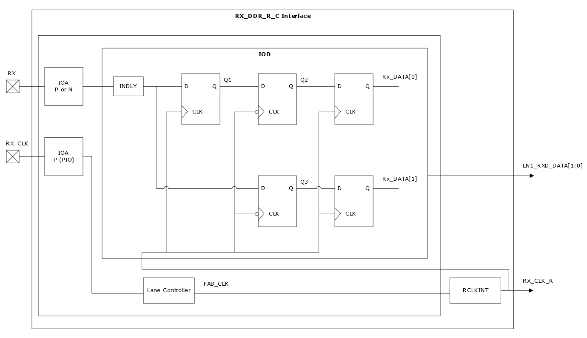

# RX\_DDR\_G\_C and RX\_DDR\_R\_C—Centered Interfaces with Static Delays

The RX\_DDR\_G\_C and RX\_DDR\_R\_C interfaces have clock and data signals at the external input pins with the clock centered along the incoming data and uses a continuous clock as shown in the following figure. This interface strategy is similar to the aligned. The Libero SoC controlled input delay is set to cancel RX vs RX\_CLK injection time to flip-flop. This is used to balance the clock and data delay—to the first flip-flop—to maintain the setup and hold requirements by compensating for the internal delays.

Using a global clock assignment receives RX data and RX\_CLK clock through I/Os and passes RX\_DATA and RX\_CLK\_R to the fabric. The input clock is passed directly to the GLOBAL CLKINT, sourced to the IOD logic, and forwarded to the fabric.

Global CLKINT resource drives the receive clock for fabric interface RX\_CLK\_R into the fabric.

The RX\_DDR centered interface using a lane clock assignment receives RX data and RX\_CLK clock through I/Os, passes RX\_DATA to the IOD, and RX\_CLK\_R to the lane controller. This uses a continuous clock. The lane controller manages the skew and passes the FAB\_CLK to RCLKINT. The input clock is sent to both the IOD and to the fabric from RCLKINT.

RCLKINT resource drives the receive clock for fabric interface RX\_CLK\_R into the fabric.

-   **[Interface Ports](GUID-99D64028-19A5-4244-ADED-CDE3D1066C3B.md)**  

-   **[Interface Selection Rules](GUID-DF812732-FB51-4F1C-B73D-E3F2FC0374C8.md)**  

**Parent topic:**[Generic I/O Interfaces](GUID-A63099D1-2595-43B7-B69C-1ABB1F7E412A.md)

