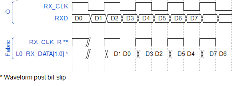
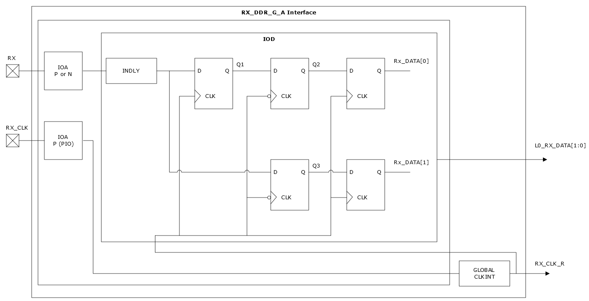
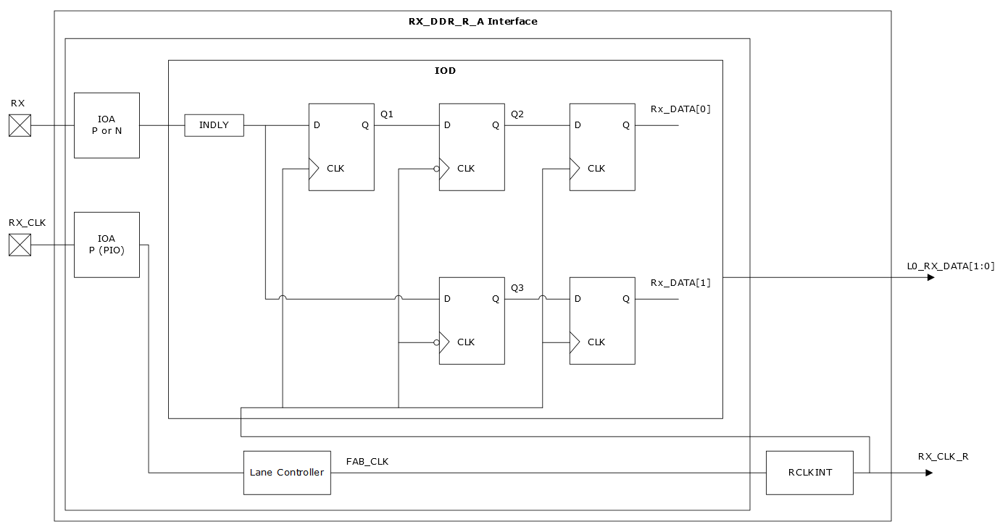

# RX\_DDR\_G\_A/ RX\_DDR\_R\_A—Aligned Interfaces with Static Delays

The RX\_DDR\_G\_A and RX\_DDR\_R\_A interfaces are used when the DDR data and clock  signals are aligned at the external input pins as shown in the following figure. This  interface uses a continuous clock. Internally, the aligned interface is required to  adjust the clock to satisfy the capture flip-flop setup and hold times. The adjustments  are done by input delay settings, which are automatically applied from the Libero SoC  software. The interfaces shown in the following figure use a gearing ratio of 1 and the  maximum X1 data rate. For more information about data rate, see respective [PolarFire FPGA Datasheet](https://ww1.microchip.com/downloads/aemDocuments/documents/FPGA/ProductDocuments/DataSheets/PolarFire-FPGA-Datasheet-DS00003831.pdf) or [PolarFire SoC FPGA Datasheet](https://ww1.microchip.com/downloads/aemDocuments/documents/FPGA/ProductDocuments/DataSheets/PolarFire-SoC-Datasheet-DS00004248.pdf). There are two interface configurations based on clock source topology being  either global or lane-based.

In the RX\_DDR aligned interface using a global clock assignment, it receives RX data and RX\_CLK clock through I/Os and passes RX\_DATA and RX\_CLK\_R to the fabric. The input clock is passed directly to the GLOBAL CLKINT that is sourced to the IOD logic. Libero SoC statically sets the input delay cells within the IOD to cancel RX vs RX\_CLK injection time to flip-flop, plus an additional offset to internally center the data/clock relationship.

Global CLKINT resource drives the receive clock for fabric interface RX\_CLK\_R into the fabric.

The RX\_DDR aligned interface using a lane clock assignment receives RX data and RX\_CLK clock through I/Os and passes RX\_DATA to the IOD. This is an aligned interface using a regional system clock distribution. This uses a continuous clock. RX\_CLK is sent to the lane controller. The lane controller manages the skew and passes the FAB\_CLK to a RCLKINT. The clock is sent to both the IOD and to the fabric from RCLKINT. Libero SoC statically sets the input delay cells within the IOD to cancel RX vs RX\_CLK injection time to flip-flop, plus an offset to internally center the data/clock relationship.

The receive clock for fabric interface RX\_CLK\_R, is driven by RCLKINT resource into the fabric.

-   **[Interface Ports](GUID-C9F02BA0-66DD-423C-A600-6B39C21DF978.md)**  

-   **[Interface Selection Rules](GUID-84BEC80F-0C02-46AB-AD1B-630252963AC2.md)**  

**Parent topic:**[Generic I/O Interfaces](GUID-A63099D1-2595-43B7-B69C-1ABB1F7E412A.md)

