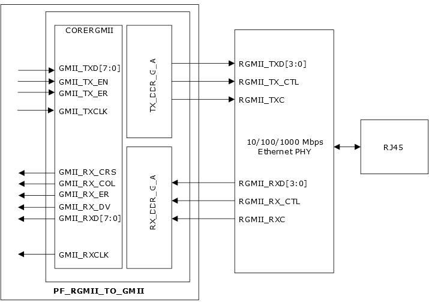
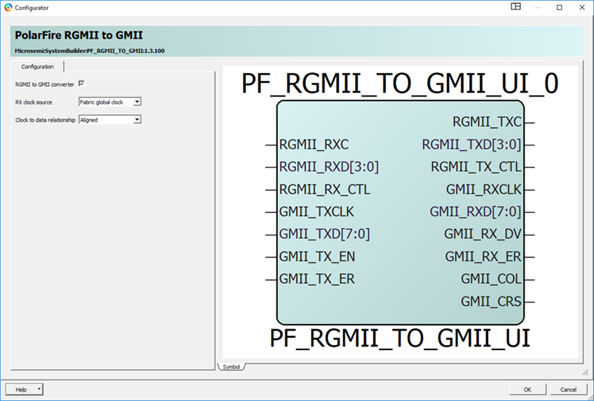

# RGMII to GMII Converter

Reduced Gigabit Media Independent Interface \(RGMII\) is a standard interface,  which helps in reducing the number of signals required to connect a PHY to a MAC. RGMII  to GMII converter provides the interface between a standard gigabit media independent  interface \(GMII\) to RGMII conversion. The IP core is compatible with the RGMII  specification v2.0 that is designed to support both the device family using the IOD  blocks used with GPIO or HSIO buffers.

The fifteen-signal GMII fabric interface adapts to six-signal RGMII interface by using both edges of the clock. All signals are synchronous with a 125 MHz clock signal. The RGMII data signals switch on the positive and negative edges of the clock. The two control signals are multiplexed—one arrives on the positive clock edge, the other on the negative edge. The PF\_IOD\_GENERIC\_TX converts GMII signals \(MAC side\) to RGMII signals \(PHY side\), and the PF\_IOD\_GENERIC\_RX converts the RGMII signals into GMII signals and passes the signals to the CoreRGMII IP block before transmission to the MAC. Externally, a 1000BASE-T Ethernet PHY is connected to RGMII through GPIO or HSIO.

See [UG0687: PolarFire FPGA 1G Ethernet Solutions User Guide](https://ww1.microchip.com/downloads/aemDocuments/documents/FPGA/ProductDocuments/UserGuides/microsemi_polarfire_fpga_1g_ethernet_solutions_user_guide_ug0687_v5.pdf) for more information.

The following table lists the GMII/RGMII ports and description.

|Port|I/O|Description|
|----|---|-----------|
|GMII\_TXCLK|Input|Clock from fabric \(GTXCLK\)|
|GMII\_TXD \[7:0\]|Input|GMII transmit data|
|GMII\_TX\_EN|Input|Transmit enable|
|GMII\_RXCLK|Output|Clock to fabric depending on RX clock  configurator option, either fabric global or fabric regional through the  iod\_generic\_tx block|
|GMII\_TX\_ER|Input|Transmit error|
|GMII\_RXD\[7:0\]|Output|MII receive data|
|GMII\_RX\_DV|Output|Receive data valid|
|GMII\_RX\_ER|Output|Receive error|
|GMII\_COL|Output|Collision, considered  asynchronous|
|GMII\_CRS|Output|Carrier sense, considered  asynchronous|
|RGMII\_TXD\[3:0\]|Output|Transmit data to PHY|
|RGMII\_TX\_CTL|Output|Transmit Control To PHY. The TX\_CTL  signal carries: 
– GMII\_TX\_EN on the rising edge 
– TX\_EN or GMII\_TX\_ER  on the falling edge|
|RGMII\_RXD\[3:0\]|Input|Receive data from PHY|
|RGMII\_RX\_CTL|Input|Receive control from PHY. The RX\_CTL  signal carries: 
– gmii\_rx\_dv \(data valid\) on the rising edge 
–  gmii\_rx\_dv xor gmii\_rx\_er on the falling edge|
|RGMII\_RXC|Input|RGMII receive clock|
|RGMII\_TXC|Input|RGMII transmit clock|

The following figure shows the RGMII to GMII configurator.

Both RX and TX IOD sub-modules are within the PF\_RGMII\_TO\_GMII conversion module. Both blocks are pre-configured for the proper clock and data alignment and gearing ratios. You are not required to change the default setting for these modules but may need to be aware of the actual configurations for informational purposes. Designs using the PF\_RGMII\_TO\_GMII conversion module must reference the pin selection rules discussed in [Interface Selection Rules](GUID-84BEC80F-0C02-46AB-AD1B-630252963AC2.md).

**Parent topic:**[Protocol-Specific I/O Interfaces](GUID-427F7D4F-0FEB-46AB-BA45-CFBED0CDC201.md)

