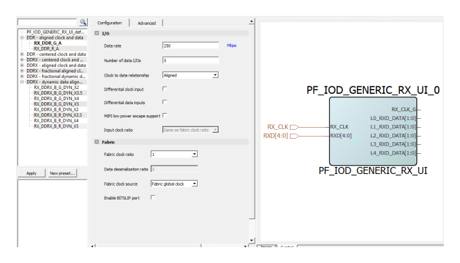
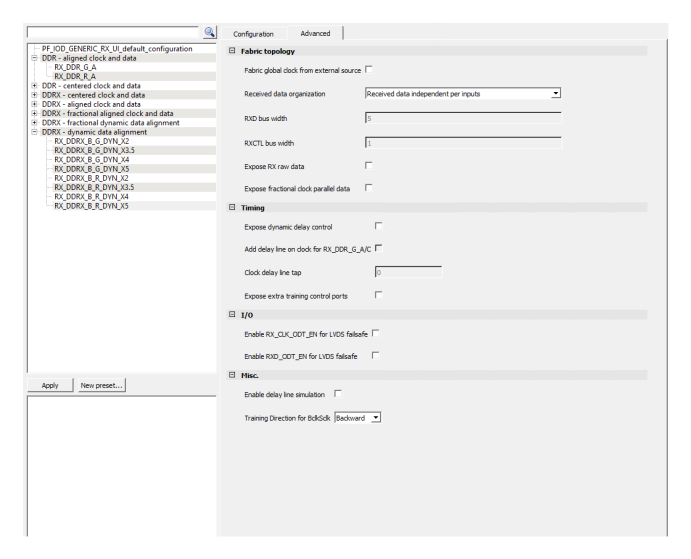

# IOD Generic RX

The following table lists the receive interface software names and their related data.

|Software Name|Ratio|Clock to Data Relationship|I/O Clock|Fabric Clock|Lane Organi
zation|One Lane Max|Dynamic Bit Training|
|-------------|-----|--------------------------|---------|------------|------------------|------------|--------------------|
|RX\_DDR\_G\_A|1|Aligned|Global|Global|✗|✗|✗|
|RX\_DDR\_R\_A|1|Aligned|Regional|Regional|✓|✓|✗|
|RX\_DDR\_G\_C|1|Centered|Global|Global|✗|✗|✗|
|RX\_DDR\_R\_C|1|Centered|Regional|Regional|✓|✓|✗|
|RX\_DDRX\_B\_G\_A|2, 3.5, 4, 5|Aligned|High-speed I/O Clock|Global|✓|✗|✗|
|RX\_DDRX\_B\_R\_A|2, 3.5, 4, 5|Aligned|High-speed I/O Clock|Regional|✓|✓|✗|
|RX\_DDRX\_B\_G\_C|2, 3.5, 4, 5|Centered|High-speed I/O Clock|Global|✓|✗|✗|
|RX\_DDRX\_B\_R\_C|2, 3.5, 4, 5|Centered|High-speed I/O Clock|Regional|✓|✓|✗|
|RX\_DDRX\_B\_G\_FA|2, 3.5, 4, 5|Fractional Aligned|High-speed I/O Clock|Global|✓|✗|✗|
|RX\_DDRX\_B\_G\_
DYN|2, 3.5, 4, 5|Dynamic|High-speed I/O Clock|Global|✓|✗|✓|
|RX\_DDRX\_B\_R\_
DYN|2, 3.5, 4, 5|Dynamic|High-speed I/O Clock|Regional|✓|✓|✓|

**Important:** For Generic RX IOD interfaces with a gearing ratio of 1, the lane controller functions are not available. Lane controller functions are only available in x2, x4, x3.5, x5 gearing ratios. As shown in preceding table, for RX\_DDR interfaces with ratio equal to 1, you cannot use a high-speed I/O clock, only global or regional clocks can be used.

The following figure shows the IOD Generic Receive Interfaces.

|GUI Option|Selections|
|----------|----------|
|Data rate|User Input[1](#ID-0000340A)|
|Number of data I/Os|User Input – Number of desired RX data  inputs \(1 to 128\)|
|Clock to data relationship|Aligned, Centered, Dynamic,  Fractional-aligned, and Fractional-dynamic2|
|Differential clock inputs|Disable \(single-ended\) and Enabled  \(differential\)|
|Differential data inputs|Disable \(single-ended\) and Enabled  \(differential\)|
|MIPI low power escape support|Disable and Enable|
|Fabric Clock Ratio|1, 2, 3.5, 4, 5|
|Data deserialization ratio|Predefined ports to the fabric from IOD  component|
|Fabric clock source|Fabric regional clockFabric global clock|
|Enable BITSLIP port|Disable and EnableExposes BITSLIP pin when enabled. See Bit Slip  for more information about Bit Slip. Not available for 3.5 Fabric  clock ratio.|
|\(1\) See  Receiver Interface \(right panel\) for valid data rates \([Figure   1](#GUID-AA04BA8A-57AE-4A3A-91C6-B697E128DAA8)\).| |

<table id="ID-00003415"><thead><tr id="ID-0000341D"><th id="ID-0000341E">

GUI Option

</th><th id="ID-00003420">

Selections

</th></tr></thead><tbody><tr id="ID-00003423"><td id="ID-00003424">

Fabric global clock for external  source

</td><td id="ID-00003426">

Disable and Enable It is enabled  when you want to use the same RX\_CLK\_G clock for the transmitter and  the receiver.

</td></tr><tr id="ID-00003428"><td id="ID-00003429">

Received data organization

</td><td id="ID-0000342B">

Received data spread over inputs,  Received data independent over inputs, Received data spread over inputs  with data/Control split.

</td></tr><tr id="ID-0000342D"><td id="ID-0000342E">

RXD bus Width

</td><td id="ID-00003430">

This allows organizing the splitting of  the data bus.

</td></tr><tr id="ID-00003432"><td id="ID-00003433">

RXCTL bus Width

</td><td id="ID-00003435">

This allows organizing the splitting of  the data bus.

</td></tr><tr id="ID-00003437"><td id="ID-00003438">

Expose Rx raw data

</td><td id="ID-0000343A">

Disable and Enable RXD\_RAW\_DATA  ports are exposed on the module. Expose raw data is available for  all fabric clock ratios except for ratio 5.

</td></tr><tr id="ID-0000343C"><td id="ID-0000343D">

Expose fractional clock parallel  data

</td><td id="ID-0000343F">

Disable and Enable For fractional  interfaces, RXD\_CLK\_DATA specifies the bit-slips needed to re-frame  data.

</td></tr><tr id="ID-00003441"><td id="ID-00003442">

Expose dynamic delay control

</td><td id="ID-00003444">

Disable and Enable See Table   1.

</td></tr><tr id="ID-00003448"><td id="ID-00003449">

Add delay line on clock for  RX\_DDR\_G\_A/C

</td><td id="ID-0000344B">

Enables the static delay chain to be  added to the clock path

</td></tr><tr id="ID-0000344D"><td id="ID-0000344E">

Clock delay line tap

</td><td id="ID-00003450">

Number of delay taps to be added.  For information, see Programmable I/O Delay.

</td></tr><tr id="ID-00003454"><td id="ID-00003455">

Enable RX\_CLK\_ODT\_EN for LVDS  failsafe

</td><td id="ID-00003457">

For information, see [Dynamic ODT or Fail-Safe LVDS](GUID-A6BFBAB6-5087-4127-A681-DE60DBA33993.md).

</td></tr><tr id="ID-0000345B"><td id="ID-0000345C">

Enable RXD\_ODT\_EN for LVDS  failsafe

</td><td id="ID-0000345E">

For information, see [Dynamic ODT or Fail-Safe LVDS](GUID-A6BFBAB6-5087-4127-A681-DE60DBA33993.md).

</td></tr><tr><td>

Expose Extra Training Control Ports

</td><td>

When selected, this option adds advanced diagnostic  ports on IOD core to connect fabric for the purpose of analyzing and  debugging the I/O interfaces. See [Table   3](GUID-BFD33E3C-71F1-4F5E-9234-B30507986C68.md#ID-00003720) for  information.

</td></tr><tr><td>

Enable delay line simulation

</td><td>

When selected, enables the delay line  simulation.

</td></tr><tr><td>

Training Direction for BclkSclk

</td><td>

  -   Forward: BCLKSCLK training performed in the forward direction.
-   Backward: BCLKSCLK training performed in the backward direction. This is option is enabled by default.

  **Note:** This parameter is used only for PLL-based clock training. The change in direction can mitigate potential divider pulse glitches as the backward direction lengthens the pulse width, thus reducing the likelihood of glitch occurrences.

 

</td></tr></tbody>
</table>**Parent topic:**[I/O Interface Configurators](GUID-CF8CE51A-E6C4-4DEC-A91C-21C8A04E9A8C.md)

