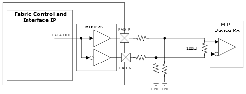

# MIPI D-PHY Transmitting Interface \(High-speed Only\)

GPIO supports unidirectional MIPI D-PHY transmit interface with the external  resistors, as shown in the following illustration. Every GPIO P and N pair \(MIPIE25\) can be  configured as a MIPI D-PHY transmit interface. MIPIE25 is a specific output mode that uses  complimentary LVCMOS output drivers and external termination resistors. This combination  matches the signaling requirements of a MIPI standard receiver as well as meets the  performance requirements based on MIPI loading and switching levels.

**Important:** Resistor value vary based on optimal performance. For resistor specifications, see respective [PolarFire FPGA Board Design User Guide](https://ww1.microchip.com/downloads/aemDocuments/documents/FPGA/ProductDocuments/UserGuides/PolarFire_FPGA_Board_Design_UG0726_V11.pdf), [PolarFire SoC FPGA Board Design Guidelines User Guide](https://ww1.microchip.com/downloads/aemDocuments/documents/FPGA/ProductDocuments/UserGuides/PolarFire_SoC_FPGA_Board_Design_Guidelines_User_Guide_VB.pdf), [RT PolarFire FPGA Board Design User Guide](https://ww1.microchip.com/downloads/aemDocuments/documents/FPGA/ProductDocuments/UserGuides/RT_PolarFire_Board_Design_User_Guide_VA.pdf), or *RT PolarFire SoC FPGA Board Design Guidelines User Guide* \(to be available in a future release\).

**Parent topic:**[Implementing MIPI D-PHY](GUID-01A145E0-6FFC-412D-8258-FBEB32C25B55.md)

