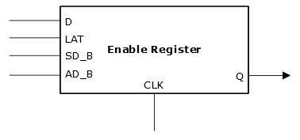

# Enable Register

The following illustration shows enable register.

The following table lists the enable register pins and their descriptions.

|Ports|Types|Descriptions|
|-----|-----|------------|
|CLK|Input|Clock input|
|D|Input|Data input|
|Q|Output|Data output|
|LAT|Input|Latch enable \(active high\)|
|SD\_B|Input|Synchronous data|
|AD\_B|Input|Asynchronous data \(active low\)|

**Parent topic:**[I/O Registers](GUID-AF2C0EDA-82DC-4FFC-90AF-1D529037F3DC.md)

