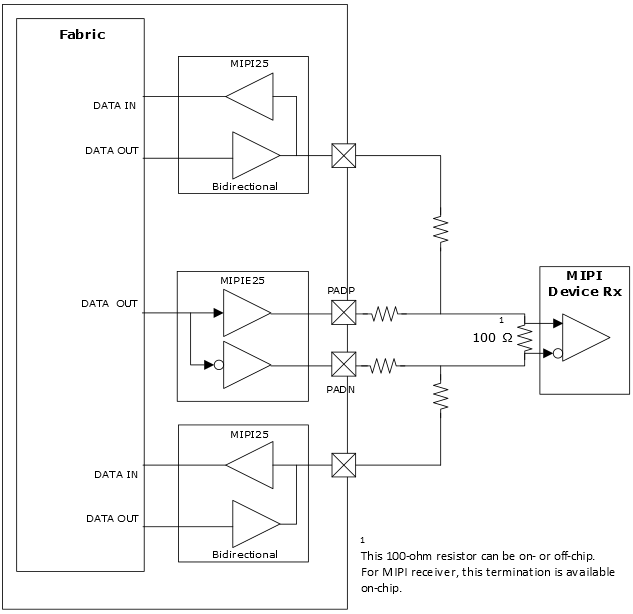

# MIPI D-PHY Transmit Interface \(High-Speed Only\) with Bidirectional Low-Power Mode

GPIO also supports a bidirectional MIPI D-PHY lane with external resistors, as shown in the following illustration. Microchip provides a macro that can be instantiated in the user design to implement the MIPI transmit interface \(high-speed only\) with bidirectional low-power mode, see [Generic I/O Interfaces](GUID-A63099D1-2595-43B7-B69C-1ABB1F7E412A.md) for more information.

**Important:** For resistor specifications, see respective [PolarFire FPGA Board Design User Guide](https://ww1.microchip.com/downloads/aemDocuments/documents/FPGA/ProductDocuments/UserGuides/PolarFire_FPGA_Board_Design_UG0726_V11.pdf), [PolarFire SoC FPGA Board Design Guidelines User Guide](https://ww1.microchip.com/downloads/aemDocuments/documents/FPGA/ProductDocuments/UserGuides/PolarFire_SoC_FPGA_Board_Design_Guidelines_User_Guide_VB.pdf), [RT PolarFire FPGA Board Design User Guide](https://ww1.microchip.com/downloads/aemDocuments/documents/FPGA/ProductDocuments/UserGuides/RT_PolarFire_Board_Design_User_Guide_VA.pdf), *RT PolarFire SoC FPGA Board Design Guidelines User Guide* \(to be available in a future release\).

**Important:** For information about implementation, see [DG0807: PolarFire Imaging and Video Kit Demo Guide \(MIPI CSI-2 Camera Sensor\)](https://ww1.microchip.com/downloads/aemdocuments/documents/fpga/ProductDocuments/UserGuides/microsemi_polarfire_fpga_video_and_imaging_with_mipi_csi2_kit_demo_guide_dg0807_v1.pdf).

**Parent topic:**[Implementing MIPI D-PHY](GUID-01A145E0-6FFC-412D-8258-FBEB32C25B55.md)

