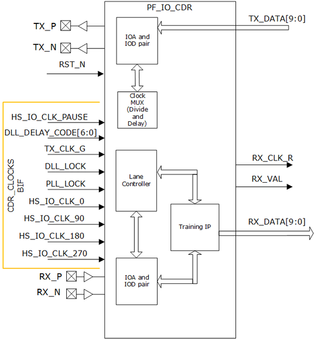
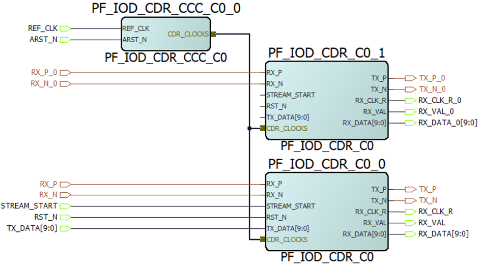

# PF\_IOD\_CDR

The PF\_IOD\_CDR interface provides an asynchronous receiver and a transmit  interface for serial data transfers. This interface can support up to 1 GbE transfers.  It supports serial protocols and other similar encoded serial protocols. PF\_IOD\_CDR uses  a 10:1 digital ratio to provide a 10-bit data and clock interface for both transmit and  receive modes. In the receive mode, the clock recovery circuit is used in the lane  controller to generate the recovered clock. The PF\_IOD\_CDR interface is compatible with  CoreTSE, CoreTSE\_AHB, and CoreSGMII configured in TBI mode. For information about  reference design using PF\_IOD\_CDR, see [AN4623: PolarFire FPGA 1G Ethernet Loopback Using IOD CDR \(Earlier DG0799\)](https://ww1.microchip.com/downloads/aemDocuments/documents/FPGA/ApplicationNotes/ApplicationNotes/PolarFire_FPGA_1G_Ethernet_Loopback_Using_IOD_CDR.pdf).

The following illustration shows the PF\_IOD\_CDR transmit and receive interface.

The IOD\_CDR solutions requires two purposes built IP cores.

-   PF\_IOD\_CDR
-   PF \_IOD\_CDR\_CCC

These two cores permit master and slave sharing. A BIF is available to connect the clock outputs from PF\_IOD CDR CCC to PF\_IOD CDR.

-   **[IOD CDR](GUID-912FE183-D850-42E3-A6DE-CA4DE5FB1946.md)**  

-   **[Receive Interface](GUID-2C915611-DC43-4117-8695-3ED9770C9B19.md)**  

-   **[Transmit Interface](GUID-BFD33E3C-71F1-4F5E-9234-B30507986C68.md)**  

-   **[IOD CDR Clocking](GUID-796E3761-49BB-436B-AB3E-85E778C3E8D0.md)**  

-   **[Clock Sharing](GUID-E7F38A66-B6E4-406B-9D50-739EC42000CF.md)**  

**Parent topic:**[Protocol-Specific I/O Interfaces](GUID-427F7D4F-0FEB-46AB-BA45-CFBED0CDC201.md)

