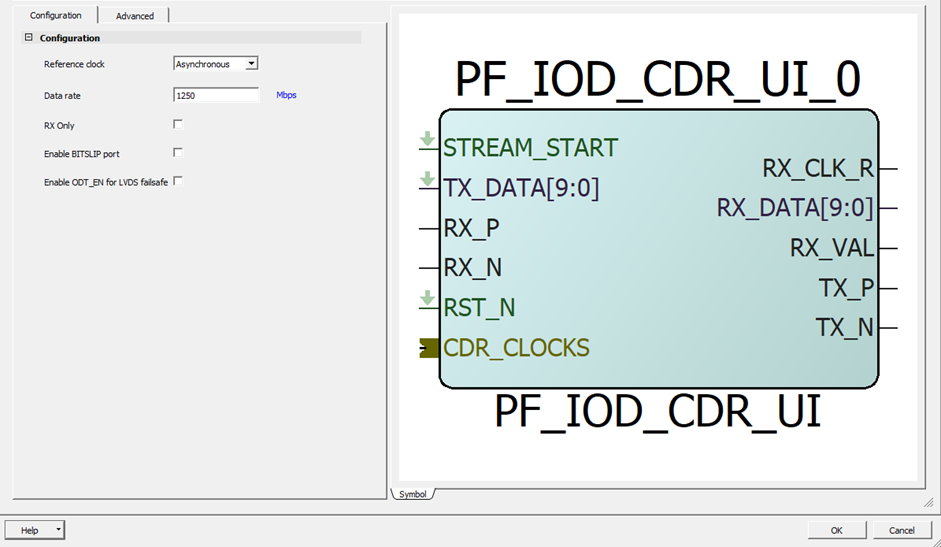

# IOD CDR

The following figure shows the IOD CDR configurator.

|GUI Option|Selections|
|----------|----------|
|Data rate|User Input – 1250 Mb/s maximum|
|Reference Clock|Asynchronous \(300 PPM Rx/Tx  clocking\)/Synchronous 
\(0 PPM Rx/TX clocking\) \(Default  Asynchronous\)|
|RX Only|RX Only \(when checked\)|
|Enable BITSLIP port|Disabled and Enabled|

**Parent topic:**[PF\_IOD\_CDR](GUID-8EA0853D-A9F3-4136-B6CC-7B515BF36957.md)

