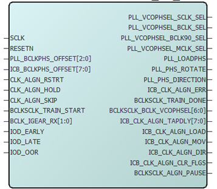
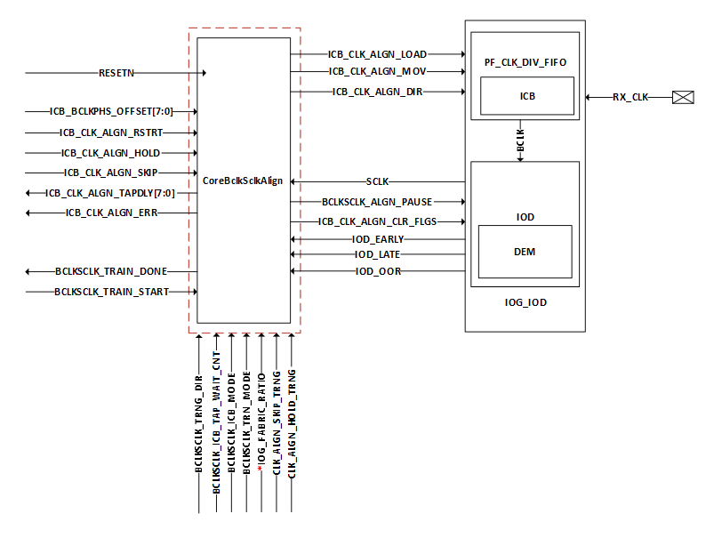
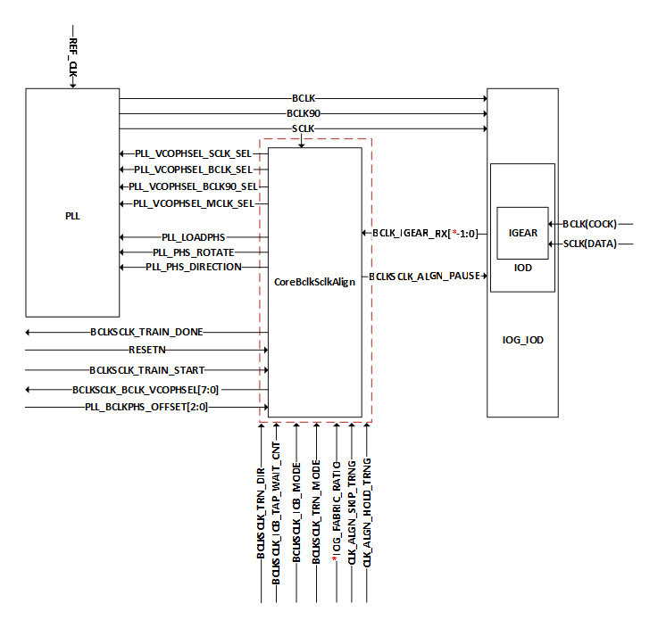

# CoreBclkSclkAlign Training IP

The CoreBclkSclkAlign training IP is provided with IOD blocks to optimize the performance of the  interfaces. This must be instantiated for all Generic IOD Rx and Tx interfaces above 400  Mbps with x2, x3.5, and x4 ratios. The IP is specifically intended for clock alignment  by using the ICB or PLL VCOPHSEL controls to move the BCLK \(HS\_IO\_CLK\) in the PLL in  reference to SCLK \(system or fabric clock\).

When creating generic IOD interfaces, the CoreBclkSclkAlign IP component is included in  the generated core of the IOD Generic Transmit Interface Clocking IP \(PF\_IOD\_TX\_CCC\) as  well as the IOD Generic Receive Interface IP \(PF\_IOD\_GENERIC\_RX\). Both of these  fabric-hosted soft IP components include the CoreBclkSclkAlign, which is instantiated by  Libero SoC during IOD configuration process for the purpose of calibrating and training  the I/O gearing elements for the use of high-speed interfaces.

The following figure shows a high-level block diagram of CoreBclkSclkAlign used for clock training in RX modes.

The following figure shows a high-level block diagram of CoreBclkSclkAlign used for clock training in TX modes.

CoreBclkSclkAlign performs clock training and is also responsible for interfacing IOD to capture  the data.

-   **[ICB-Based Fine Training Method](GUID-A1FBDF41-ABD5-4F24-BCDF-C13F53B9C684.md)**  

-   **[PLL-Based Coarse Training Method](GUID-8DFB079A-3371-469C-9AEC-4650A25CEF01.md)**  

-   **[Example Training Algorithm](GUID-7B16E50B-ECD4-47DC-979B-313EFB5C9657.md)**  

-   **[CoreBclkSclkAlign Coarse Training Timing Diagram](GUID-BC95EECA-1201-4BA4-B277-85B6B1E160D3.md)**  

**Parent topic:**[Dynamic IOD Interface Training](GUID-78782CBA-B102-43F0-809A-790406FCEFC8.md)

