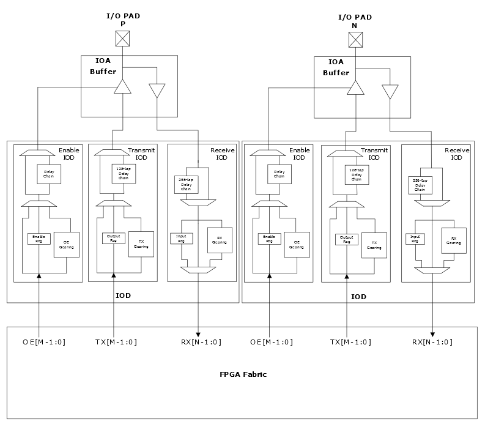

# IOD Block Overview

The IOD block includes the input and output delay functions, I/O  registers, and digital logic blocks. The digital logic blocks are receive digital \(Rx  digital\) for input, transmit digital \(Tx digital\) for output, and enable digital \(OE  digital\) for the enable signals. The IOD block also includes several high-speed, low-skew  clock networks. [Figure   1](#GUID-91275C22-1434-42D9-9D15-4C688EF76796) shows an overview of the IOD block. Various I/O features are set mainly  by the protocol configurator or the Libero SoC configurator within Libero SoC. However,  some of the I/O features such as I/O register and programmable delay can be controlled  automatically or manually by Libero SoC.

The following illustration shows an overview of the IOD block.

**Note:** The values of M and N depend on the digital ratio. Enable path delay is not customizable by the user design.

-   **[Programmable I/O Delay](GUID-90C2D28A-F084-436E-9F82-00C82B27D19C.md)**  

-   **[I/O Registers](GUID-AF2C0EDA-82DC-4FFC-90AF-1D529037F3DC.md)**  

-   **[I/O Gearing](GUID-DD47D6B9-C518-4919-BEDA-AA8751E0515A.md)**  

-   **[I/O FIFO](GUID-F7DE9451-C525-4975-9053-9CDCAAA2E884.md)**  

**Parent topic:**[IOD Features and User Modes](GUID-07762CFD-2C12-4CB2-A30A-22A7794DF08F.md)

